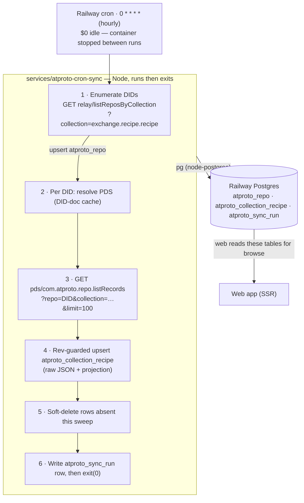

# Plan: `atproto-cron-sync` — Atmosphere → Postgres Sync Cron Service

Status: **built** (2026-07-27), backfill not yet run. Written 2026-07-26. See
[§9 Implementation results](#9-implementation-results-2026-07-27) for what
actually shipped and where it deviated from this plan.

Goal: a **cron service** that periodically sweeps the atproto network for
`exchange.recipe.*` records and mirrors them into Buttery's Postgres index. This
is Stage 1 of the ingestion strategy from
[`docs/research/04-ingestion-and-sync.md`](../research/04-ingestion-and-sync.md)
§5 — index-on-write + cron reconciliation, **no Tap yet**. Focus here is on
_filling / reconciling the database_, not on how the web app reads it.

---

## 0. Decisions locked (from the planning conversation)

| Question         | Decision                                                                                                                                                                                                       |
| ---------------- | -------------------------------------------------------------------------------------------------------------------------------------------------------------------------------------------------------------- |
| Shape            | A normal **service**, not a "function". Named **`atproto-cron-sync`**.                                                                                                                                         |
| Runtime          | **Plain Node** — same toolchain as web (`node = 26` in `mise`). No Bun, no Deno.                                                                                                                               |
| Placement        | **`services/atproto-cron-sync/`**, a sibling to `services/web`, as a normal **pnpm workspace package** (`@buttery/atproto-cron-sync`). Matches the existing `services/*` workspace glob — no workspace change. |
| DB access        | **Raw `pg`** (node-postgres) — the _same_ package/version web uses (`pg` ^8.22.0). No Kysely, no generated types; queries hand-written and small.                                                              |
| Schema ownership | New tables live in the **existing web kysely migration pipeline**. The cron is a pure _writer_; web owns DDL and runs `db:migrate:up` at deploy.                                                               |
| Trigger          | Railway **cron service** (github source, `deploy.cronSchedule`). Runs its start command on schedule and **must exit** when done.                                                                               |

### It's a service, not a Railway "Function"

Railway's [Functions](https://docs.railway.com/functions) product (a Bun
single-file service edited in the dashboard — 1 file, 96 KB cap, no repo) is
**not** what this is. `atproto-cron-sync` is an ordinary git-versioned Node
package in `services/`, which Railway runs as a **cron service**: a
github-sourced service with `deploy.cronSchedule` that runs `node …` and exits
(Railway skips the next run if the previous is still `Active`).

---

## 1. Architecture overview



- **Fully idempotent, stateless-between-runs.** Each sweep re-enumerates the
  whole network from scratch. There's no cursor to lose, no replay window to
  outrun — the cron _is_ the reconciliation job. This is exactly why Stage 1 is
  cheap for a low-volume NSID.
- **`exchange.recipe.recipe` only, to start.** `collection` and `profile` are
  deferred (see §7). The schema is shaped so adding them later is a new
  `collection` value, not a rewrite.
- **All network input is untrusted.** Anyone can write anything into their own
  repo. Store the raw record JSON; project a handful of columns; mark a
  validation status; never drop a repo's other records because one was bad
  (research doc 03 §7 rule).

### The sync algorithm (Stage 1, verbatim from research doc 04 §4/§5)

1. **Enumerate.** Page
   `GET <relay>/xrpc/com.atproto.sync.listReposByCollection?collection=exchange.recipe.recipe&limit=2000&cursor=…`
   against `relay1.us-east.bsky.network` (fallback `us-west`). Upsert each DID
   into `atproto_repo` (sets `first_seen_at`, clears `missing_since`).
2. **Resolve PDS.** For each DID, resolve the DID doc → PDS endpoint. Cache the
   endpoint on `atproto_repo.pds`; only re-resolve when null/stale. `did:plc`
   via `https://plc.directory/<did>`; `did:web` via `/.well-known/did.json`.
   (Reuse the logic already in `services/web/src/lib/atproto/recipes.ts`
   `resolvePds` — port it, don't import; different package, no shared lib yet.)
3. **List records.** Page
   `GET <pds>/xrpc/com.atproto.repo.listRecords?repo=<did>&collection=exchange.recipe.recipe&limit=100&cursor=…`,
   unauthenticated. Collect `{uri, cid, value}` and the repo `rev`.
4. **Upsert.** One rev-guarded upsert per record into `atproto_collection_recipe`
   (SQL in §2). Lightweight structural validation → `validation_status`. Store
   raw `value` as `jsonb`.
5. **Reconcile deletes.** Records in `atproto_collection_recipe` for that DID whose `rkey` was
   **not** seen in this DID's full listRecords enumeration → set `deleted_at`
   (soft delete). Only safe when the DID's listing completed without error —
   track that per DID and skip delete-reconciliation on partial failures.
6. **Bookkeeping.** Update `atproto_repo.last_synced_at`; write one `atproto_sync_run`
   summary row (counts + status). `exit(0)`.

### Concurrency & ordering

- Shard the per-DID work with a small concurrency pool (**~8 concurrent DIDs**).
  Records within one DID are a single enumeration — per-repo ordering is
  automatic. Never interleave writes for the same DID.
- Batch record upserts (~100–500 rows per multi-row `INSERT … ON CONFLICT`),
  **partitioned by DID**.
- Be a polite network citizen: cap total in-flight HTTP, back off on 429/5xx,
  short per-request timeout. `exchange.recipe.recipe` is low-volume — a full
  sweep should be minutes. **Measure the first real sweep and set the cron
  interval from it** (research doc 04 §5).

### Idempotency — the one rule that makes this safe

Every write is a rev-guarded upsert keyed on `(did, rkey)`. `rev` is a TID
(lexicographically sortable, monotonic per repo), so writes are
order-insensitive and duplicate-safe. A stale duplicate simply loses the
`WHERE recipe.rev < excluded.rev` guard and no-ops.

---

## 2. Postgres tables

Three tables. They live as a **new kysely migration in the web package**
(`services/web/src/db/migrations/<ts>_create_sync_index.ts`) so the existing
`preDeploy: pnpm --filter @buttery/web db:migrate:up` creates them and
`pnpm db:codegen` regenerates `services/web/src/db/types.ts` for the web app's
_read_ side. The cron writes them with raw `pg` SQL and does **not** depend on
those types.

> **App-owned tables use snake_case and are prefixed `atproto_`** (confirmed
> convention). These are raw storage of atproto records mirrored for sync. The
> camelCase better-auth tables are that way by necessity; everything Buttery
> owns — including these — is snake_case.

### `atproto_repo` — one row per tracked DID

| Column           | Type                               | Notes                                                                         |
| ---------------- | ---------------------------------- | ----------------------------------------------------------------------------- |
| `did`            | `text` PK                          | the repo owner; **key everything on DID, never handle**                       |
| `pds`            | `text` null                        | cached PDS service endpoint                                                   |
| `handle`         | `text` null                        | cache only — re-resolve, never treat as truth                                 |
| `status`         | `text` not null default `'active'` | `active\|takendown\|suspended\|deactivated\|deleted`                          |
| `first_seen_at`  | `timestamptz` not null default now | when discovery first saw this DID                                             |
| `last_synced_at` | `timestamptz` null                 | last successful listRecords sweep                                             |
| `missing_since`  | `timestamptz` null                 | first sweep this DID stopped appearing in enumeration (candidate for cleanup) |
| `last_error`     | `text` null                        | last sweep error for this DID                                                 |

Index: `status`. (Discovery source `listReposByCollection` is built from
observed firehose traffic → best-available, not provably complete; a DID
dropping out of enumeration is not proof of deletion. Hence `missing_since`
rather than immediate purge.)

### `atproto_collection_recipe` — the record index (the table web browses)

| Column              | Type                                               | Notes                                                                                        |
| ------------------- | -------------------------------------------------- | -------------------------------------------------------------------------------------------- |
| `did`               | `text` not null                                    | FK-ish to `atproto_repo.did` (no hard FK — sync order)                                       |
| `rkey`              | `text` not null                                    | record key (ULID/TID)                                                                        |
| `collection`        | `text` not null default `'exchange.recipe.recipe'` | future-proofs multi-collection                                                               |
| `uri`               | `text` not null                                    | `at://did/collection/rkey`, denormalized                                                     |
| `cid`               | `text` not null                                    | current record CID                                                                           |
| `rev`               | `text` not null                                    | repo commit rev (TID) — **the upsert guard**                                                 |
| `record`            | `jsonb` not null                                   | **raw record value**, lossless (never round-trip through a lossy parse — research doc 03 §7) |
| `name`              | `text` null                                        | projected `record.name` for browse/search                                                    |
| `record_created_at` | `timestamptz` null                                 | projected `record.createdAt`                                                                 |
| `record_updated_at` | `timestamptz` null                                 | projected `record.updatedAt`                                                                 |
| `validation_status` | `text` not null default `'unknown'`                | `valid\|unknown\|invalid`                                                                    |
| `indexed_at`        | `timestamptz` not null default now                 | when this row was last written                                                               |
| `deleted_at`        | `timestamptz` null                                 | **soft delete**; a later higher-`rev` create resurrects                                      |

- **Primary key: `(did, rkey)`.** (Include `collection` in the PK only if/when
  a second collection lands in this same table — see §7.)
- Indexes: `(name)` for browse; `(indexed_at)` for "recently synced"; partial
  `WHERE deleted_at IS NULL` for the live set; optional `GIN (record)` if you
  later query inside the JSON.

**The upsert (raw `pg`, parameterized):**

```sql
insert into atproto_collection_recipe
  (did, rkey, collection, uri, cid, rev, record, name,
   record_created_at, record_updated_at, validation_status, indexed_at, deleted_at)
values
  ($1, $2, $3, $4, $5, $6, $7, $8, $9, $10, $11, now(), null)
on conflict (did, rkey) do update set
  cid                = excluded.cid,
  rev                = excluded.rev,
  record             = excluded.record,
  name               = excluded.name,
  record_created_at  = excluded.record_created_at,
  record_updated_at  = excluded.record_updated_at,
  validation_status  = excluded.validation_status,
  indexed_at         = now(),
  deleted_at         = null                          -- resurrect on re-create
where atproto_collection_recipe.rev < excluded.rev;  -- rev guard: order-insensitive, dup-safe
```

```ts
// values array for the statement above
await pool.query(UPSERT_RECIPE_SQL, [
  did,
  rkey,
  collection,
  uri,
  cid,
  rev,
  record /* pg serializes an object into jsonb */,
  name,
  recordCreatedAt,
  recordUpdatedAt,
  validationStatus,
]);
```

Soft-delete reconciliation for one fully-swept DID (`$2` = the rkeys seen this
sweep, passed as a `text[]`):

```sql
update atproto_collection_recipe
   set deleted_at = now()
 where did = $1
   and deleted_at is null
   and rkey <> all($2::text[]);
```

### `atproto_sync_run` — observability / drift alarm

| Column             | Type                                | Notes                                 |
| ------------------ | ----------------------------------- | ------------------------------------- |
| `id`               | `bigserial` PK                      |                                       |
| `started_at`       | `timestamptz` not null default now  |                                       |
| `finished_at`      | `timestamptz` null                  |                                       |
| `status`           | `text` not null default `'running'` | `running\|ok\|error`                  |
| `repos_seen`       | `integer` not null default 0        |                                       |
| `records_upserted` | `integer` not null default 0        |                                       |
| `records_deleted`  | `integer` not null default 0        |                                       |
| `repos_failed`     | `integer` not null default 0        |                                       |
| `error`            | `text` null                         | first fatal error, if the run aborted |

Powers the research doc 06 §5 alarm "reconciliation sweep finding a growing
diff" — watch `records_deleted` / `repos_failed` trends and run duration.

---

## 3. `services/atproto-cron-sync` package layout

```
services/
  atproto-cron-sync/
    package.json        # name @buttery/atproto-cron-sync; deps: pg (^8.22.0)
    tsconfig.json       # extends ../../tsconfig.base.json
    .env.example        # DATABASE_URL=...
    README.md           # local-run instructions (mirror of §6)
    src/
      main.ts           # entrypoint: parse args, run one sweep, exit(0/1)
      config.ts         # env parsing (DATABASE_URL, RELAY_URL, concurrency, flags)
      db.ts             # pg Pool (single pool; end() on exit)
      http.ts           # getJson: fetch + timeout + 429/5xx backoff (shared)
      relay.ts          # listReposByCollection paging
      identity.ts       # DID → PDS resolution (ported from web resolvePds)
      pds.ts            # getLatestCommit rev + listRecords paging
      recipe.ts         # upsert + soft-delete SQL, lightweight validation
      sweep.ts          # orchestration: enumerate → per-DID pool → reconcile
      log.ts            # structured console logging
```

- **A pnpm workspace member.** Already covered by `pnpm-workspace.yaml`'s
  `services/*` glob — no change needed. `pnpm install` at the repo root wires it
  up alongside web.
- **Lean deps.** **`pg`** (same major/version as web, so one resolved copy in
  the workspace) + **`es-toolkit`** (zero-dep, ESM, tree-shakeable — string/array
  utils instead of hand-rolled helpers; repo convention prefers es-toolkit) +
  **`dayjs`** (with the `duration` plugin — parses ISO-8601 duration strings for
  the `*_seconds` projections) + `@types/pg` as a dev dep. **dayjs import note:**
  Node's native ESM resolver needs the explicit `.js` on the plugin subpath —
  `import duration from "dayjs/plugin/duration.js"` (the root `import dayjs from
"dayjs"` is fine; `dayjs/esm` is a bundler-only build with extensionless
  internal imports that Node's ESM rejects — do not use it). Node ships `fetch`
  (Node 18+) and native `.ts` execution (type-stripping, stable in Node 26) — so
  `node src/main.ts` runs the TypeScript directly, **no bundler and no
  transpile/build step**.
  - Plain-Node service, no React — every source file is `.ts` (never `.tsx`).
  - Node's type-stripping only handles **erasable** TS (type annotations,
    `import type`). Avoid TS constructs that emit runtime code — `enum`,
    `namespace`, constructor parameter properties, `import =` — and `node`
    executes the files as-is with nothing extra installed.
- **No `@buttery/lexicons` import.** Cross-package friction for little gain at
  ingest. Validation here is a hand-written structural check (required fields
  present & typed) → `validation_status`; the web app does full `@atproto/lex`
  validation on read. If richer ingest validation is wanted later, vendor the
  lexicon JSON into this package and validate with a small checker.
- **No Kysely, no generated types** (per decision). `pg` queries are
  hand-written `const … SQL` strings + `pool.query(sql, values)`.

### `package.json` (sketch)

```jsonc
{
  "name": "@buttery/atproto-cron-sync",
  "version": "0.0.0",
  "private": true,
  "type": "module",
  "imports": { "#/*": "./src/*" },
  "scripts": {
    "start": "node src/main.ts", // Railway cron start command
    "sync:once": "node src/main.ts --once",
    "typecheck": "tsc --noEmit",
  },
  "dependencies": {
    "pg": "^8.22.0", // same as @buttery/web
  },
  "devDependencies": {
    "@types/pg": "^8.20.0",
    "@types/node": "^22.10.2",
    "typescript": "...",
  },
}
```

### `main.ts` shape (sketch, not final code)

```ts
// services/atproto-cron-sync/src/main.ts
import { runSweep } from "#/sweep";
import { closeDb } from "#/db";

const args = new Set(process.argv.slice(2)); // --once, --dry-run
const limit = Number(process.env.SYNC_MAX_REPOS ?? 0); // 0 = all; small for local bootstrap

try {
  const summary = await runSweep({
    dryRun: args.has("--dry-run"),
    maxRepos: limit || undefined,
  });
  console.log(JSON.stringify({ level: "info", msg: "sweep complete", ...summary }));
  process.exitCode = 0;
} catch (err) {
  console.error(JSON.stringify({ level: "error", msg: "sweep failed", err: String(err) }));
  process.exitCode = 1; // non-zero so Railway marks the cron run failed
} finally {
  await closeDb(); // MUST end the pg pool or the cron process never exits
}
```

> **The exit contract is load-bearing.** Railway skips the next scheduled run if
> the previous deployment is still `Active`. Call `pool.end()` in `finally` and
> let the process exit naturally. Do not leave timers/sockets open.

---

## 4. `mise.toml` change

**None.** `node = 26` already covers the runtime, and there is no convenience
task (an earlier `[tasks.sync]` was removed — run the sweep with the explicit
`railway run …` commands in §6). Node 26 runs `.ts` natively, so
`node src/main.ts` needs no extra tooling as long as the code stays
erasable-only — see §3.

---

## 5. Railway topology & cost (`.railway/railway.ts`)

### The cron model _is_ the "serverless" you want

Railway **bills compute by the minute**, and a **cron service's container is
stopped between executions**. So this service costs **$0 while idle** and is
billed only for the ~1–3 minutes each sweep actually runs. There is nothing to
"spin up only on schedule" — that is exactly what a cron service does.

**Do _not_ enable Railway's "Serverless" toggle** (formerly App-Sleeping) on it.
That feature is for _always-on HTTP services_ that go idle: it sleeps after
10 min of no **outbound** traffic, **still consumes an infra slot**, and adds
cold-boot 502s. A cron job holds an active pg connection and makes outbound HTTP
the entire time it runs (so it would never be considered idle anyway), and
between runs it isn't running at all. Wrong tool — the cron scheduler already
gives true scale-to-zero. (Refs:
[Serverless](https://docs.railway.com/deployments/serverless),
[Cron Jobs](https://docs.railway.com/cron-jobs).)

### What it actually costs

Rates: **CPU $20/vCPU/mo, RAM $10/GB/mo, egress $0.05/GB, volume $0.15/GB/mo —
billed by the minute** ([pricing](https://docs.railway.com/pricing)). A sweep of
a low-volume NSID is I/O-bound (mostly waiting on the network), so budget
~0.15 vCPU avg and ~256 MB while running. Rough monthly compute:

| Schedule                 | Run len | Running time/mo | ≈ CPU+RAM cost |
| ------------------------ | ------- | --------------- | -------------- |
| `*/15 * * * *` (15 min)  | 2 min   | ~96 h           | ~$0.7/mo       |
| `0 * * * *` (hourly)     | 2 min   | ~24 h           | ~$0.18/mo      |
| `0 */6 * * *` (6-hourly) | 3 min   | ~6 h            | ~$0.05/mo      |

Egress is **~$0**: every atproto response (listRecords, plc.directory, DID docs)
is **inbound**, and inbound is not billed — only our tiny outbound request bodies
count. No volume. So the cron's marginal cost is **noise (<$1/mo)** and it draws
from the same plan credit (Hobby $5 / Pro $20) the rest of the stack uses; it
does **not** need a separate budget line.

### Cost levers (cheapest first, most already baked in)

1. **Cron model, not an always-on worker.** Biggest lever, already the design.
   $0 between runs.
2. **Run as rarely as freshness allows.** Freshness = the cron interval, and
   index-on-write already makes Buttery's _own_ recipes appear instantly — the
   cron only catches **cross-app / external** edits. **Recommend hourly
   (`0 * * * *`)** to start, not `*/15`; drop to every few hours if the diff is
   usually empty. Fewer runs = less compute.
3. **Keep each run short & lean** (compute is per-minute): small memory
   footprint (stream/paginate, never buffer the whole network), modest
   `SYNC_CONCURRENCY`, short per-request timeouts, exit the instant work is done.
4. **Incremental sync later** — stop paging a repo's `listRecords` at the last
   known high-water `rev` instead of re-reading everything each run. Shortens
   runs → less compute. (Optimization, not needed for v1.)
5. **Private-network `DATABASE_URL`** (already used) — internal traffic isn't
   billed as egress; the public TCP-proxy URL _is_.
6. **No volume** — reuse the shared Postgres. Avoids $0.15/GB/mo.
7. **Scoped `watchPatterns`** (already in the snippet) — web pushes don't rebuild
   the cron and vice-versa; **build minutes are billed too**.
8. **Set a usage alert / limit** in Railway
   ([cost control](https://docs.railway.com/pricing/cost-control)) as a backstop
   against a runaway sweep.

> The real cost of the stack is **web** (always-on SSR) + **Postgres**
> (always-on + volume). This cron is a rounding error on top of that.

### Service definition

Add a third service alongside `db` and `web`. It shares the Postgres over the
private network (ingress not billed), runs on a cron schedule, and its
`watchPatterns` keep it from rebuilding on web-only pushes (and vice-versa).
Because it's a workspace package, build from the repo root exactly like web.

```ts
// inside defineRailway((ctx) => { ... })
const sync = service("atproto-cron-sync", {
  source: github("dcousineau/buttery"),
  // Same monorepo build model as web: install the whole workspace, filter to
  // this package. No build step — Node runs the TS directly at start.
  build: {
    buildCommand: "pnpm install --frozen-lockfile",
    watchPatterns: ["services/atproto-cron-sync/**", "pnpm-lock.yaml"],
  },
  start: "pnpm --filter @buttery/atproto-cron-sync start",
  deploy: {
    cronSchedule: "0 * * * *", // hourly (UTC). Cost-optimal default; index-on-write
    //                            covers Buttery's own writes, so this only reconciles
    //                            cross-app edits. Tighten to */15 only if freshness demands.
    restartPolicyType: "NEVER", // a completed cron must not be restarted into a loop
  },
  // Do NOT enable the "Serverless"/app-sleeping toggle here — see §5 cost notes.
  env: {
    DATABASE_URL: db.env.DATABASE_URL, // private networking; reuse the same Postgres
    RELAY_URL: "https://relay1.us-east.bsky.network",
  },
});

return project("buttery", {
  resources: [db, web, sync], // ← add sync
});
```

Notes / traps (from research doc 06 §3):

- **No public domain, no volume, no healthcheck.** A cron that exits has no port
  to health-check; setting `healthcheckPath` would hang the deploy.
- **App-sleeping is irrelevant** — the service isn't long-lived; it runs and dies.
- `restartPolicyType: NEVER` avoids restart loops on a job that legitimately
  exits. Use `ON_FAILURE` with a small `restartPolicyMaxRetries` only if you
  want automatic retry of a crashed sweep before the next scheduled run.
- The DDL still ships via **web's** `preDeploy` migrate step — the sync service
  has no migration responsibility. If web and sync ever need to deploy schema
  independently, that's the trigger to extract a `@buttery/db` package (already
  anticipated in the web service's IaC comment).

---

## 6. Running locally / bootstrapping the database

The point of local runs: **populate a fresh dev DB with real network data** so
web development has something to render.

**One-time setup**

1. `mise install` — installs node/pnpm/railway.
2. `pnpm install` at the repo root — wires up `@buttery/atproto-cron-sync`.
3. Ensure the local dev Postgres is up (`railway dev`; the user owns
   start/reset — see the `buttery-local-dev-db` memory).
4. **Create the tables** via the web migration pipeline (web owns DDL):
   ```bash
   railway run --service buttery -- pnpm --filter @buttery/web db:migrate:up
   # then regenerate web's read-side types:
   railway run --service buttery -- pnpm --filter @buttery/web db:codegen
   ```

**Run a sweep (fills the DB)**

`DATABASE_URL` must point at the local dev DB. Easiest is to let Railway inject
it (same pattern as migrations):

```bash
# full network sweep (minutes for a low-volume NSID):
railway run --service atproto-cron-sync -- pnpm --filter @buttery/atproto-cron-sync sync:once

# fast partial bootstrap while iterating (cap repos):
SYNC_MAX_REPOS=25 railway run --service atproto-cron-sync -- pnpm --filter @buttery/atproto-cron-sync sync:once

# dry run — hit the network, log what would be written, touch nothing:
railway run --service atproto-cron-sync -- pnpm --filter @buttery/atproto-cron-sync start -- --once --dry-run
```

Or, once `services/atproto-cron-sync/.env` has `DATABASE_URL`, load it and run
directly: `pnpm --filter @buttery/atproto-cron-sync sync:once` (Node picks up
`.env` via `--env-file` if you add it to the script, or `process.loadEnvFile()`
in `config.ts`, matching the pattern in `services/web/kysely.config.ts`).

> **Sandbox caveat** (from the `buttery-railway-run-commands` memory): the dev
> DB host and the atproto network hosts are **not** in the command sandbox
> allowlist. Run these with a real-network shell (the `!` prefix in the prompt),
> not a sandboxed Bash call.

**Suggested dev flags** (implement in `config.ts`):

| Flag / env         | Effect                                                          |
| ------------------ | --------------------------------------------------------------- |
| `--once`           | Run exactly one sweep and exit (the only mode for now).         |
| `--dry-run`        | Fetch + log, no writes. Good for measuring sweep size/duration. |
| `SYNC_MAX_REPOS=N` | Stop after N DIDs — fast partial bootstrap.                     |
| `SYNC_ONLY_DID=…`  | Sync a single DID — debugging one repo.                         |
| `SYNC_CONCURRENCY` | Per-DID pool size (default ~8).                                 |
| `RELAY_URL`        | Override the enumeration relay.                                 |

---

## 7. Deferred / out of scope (deliberately)

- **`exchange.recipe.collection` & `exchange.recipe.profile`.** The `atproto_`
  table prefix + `collection` column generalize this; add them as extra
  `collection` values in `atproto_collection_recipe` or as sibling
  `atproto_collection_*` tables when the web app needs them. Collections have
  the read-modify-write / `swapRecord` sharp edge
  (research doc 00 §4) — a sync concern only on the _write_ path, which this
  cron doesn't touch.
- **Tap (Stage 2).** When cross-app recipes must appear in seconds, the sweep
  exceeds 5 min, or you want verified provenance / per-event notifications. The
  cron **stays** as the reconciliation backstop even after Tap lands (research
  doc 04 §6). Tap reuses `$DATABASE_URL` and the same `atproto_collection_recipe` upsert.
- **Index-on-write outbox.** The other half of Stage 1 — writing to Postgres in
  the same flow as writing to the user's PDS — lives in the web app, not here.
- **Blobs / images.** `#image` blobs (`com.atproto.sync.getBlob`) are a web
  read-path/CDN concern, not ingest. The cron stores the blob refs inside
  `record` jsonb as-is.
- **Full lexicon validation at ingest.** Hand-written structural check only;
  full `@atproto/lex` validation happens web-side on read.

---

## 8. Open questions to resolve before/while building

1. **Relay `listReposByCollection` availability** — served by the new relays'
   `collectiondir` microservice, noted "not strictly required by the protocol."
   Verify `relay1.us-east` answers for `exchange.recipe.recipe`; keep a
   `us-west` fallback. (research doc 04 §4)
2. **Measure the first real sweep** — DID count, wall-clock, egress — then set
   the cron interval (and decide if `SYNC_CONCURRENCY` needs tuning). If it
   already flirts with 5 min, that's the Tap trigger.
3. **PDS resolution load** — hammering `plc.directory` per DID per sweep may
   warrant Slingshot (`resolveMiniDoc`) or a longer `atproto_repo.pds` cache TTL.
4. **`did:web` repos** — rare but possible; the ported resolver handles them,
   confirm against a real one if any exist in the recipe namespace.
5. **Node native `.ts` execution** — confirm `node src/main.ts` runs cleanly on
   Node 26 for every source file (should, as long as the code stays
   erasable-only per §3 — no `enum`/`namespace`/param-properties).
6. **Cost** — the cron itself is <$1/mo (see §5); it draws from the existing
   plan credit and needs no separate budget. The open question is only whether
   **web + Postgres** already exceed the Hobby $5 credit (research doc 06 §2) —
   if so, that's a Pro-plan decision independent of this service.

```

---

## 9. Implementation results (2026-07-27)

Built end-to-end per this plan. Backfill deliberately **not** run — to be run
manually (see §6). Everything below is committed and verified locally.

### What shipped

- **Migration** — `services/web/src/db/migrations/1785110816625_create_sync_index.ts`.
  Three tables (`atproto_repo`, `atproto_collection_recipe`, `atproto_sync_run`)
  exactly as §2, built with the Kysely schema builder + `Kysely<any>` (matches
  the initial migration's frozen-in-time convention). `atproto_collection_recipe`
  PK is `(did, rkey)`; indexes on `status`, `name`, `indexed_at`, plus a partial
  `atproto_collection_recipe_live_idx` on `(did, rkey) WHERE deleted_at IS NULL`.
  Web owns the DDL; the cron never migrates.
- **Package** — `services/atproto-cron-sync/` (`@buttery/atproto-cron-sync`),
  workspace member via the existing `services/*` glob. Files:
  `main.ts`, `config.ts`, `db.ts`, `http.ts` (see deviations), `log.ts`,
  `relay.ts`, `identity.ts`, `pds.ts`, `recipe.ts`, `sweep.ts`, plus
  `package.json`, `tsconfig.json`, `.env.example`, `README.md`. Only runtime dep
  is `pg ^8.22.0`; `@types/pg` + `@types/node` + `typescript` as dev deps. No
  build step — Node 26 type-strips the `.ts` at start.
- **`mise.toml`** — no change (an earlier `[tasks.sync]` task was removed).
- **`.railway/railway.ts`** — added the third `service("atproto-cron-sync", …)`:
  github source, `build.buildCommand = pnpm install --frozen-lockfile`, scoped
  `watchPatterns`, `start = pnpm --filter … start`,
  `deploy.cronSchedule = "0 * * * *"`, `deploy.restartPolicyType = "NEVER"`,
  private-network `DATABASE_URL` + `RELAY_URL`. No serverless toggle, no domain,
  no volume, no healthcheck. Added to `project(...).resources`.

### Deviations from the plan (both intentional)

1. **Added `src/http.ts`** — not in the §3 file sketch. A single `getJson`
   helper with per-request timeout + bounded exponential backoff on 429/5xx and
   transient network errors, shared by `relay.ts` / `identity.ts` / `pds.ts`.
   Cheaper than three copies of the retry logic; keeps the "polite network
   citizen" rule (§1) in one place.
2. **Rev guard uses the repo-level `rev`.** `listRecords` returns no per-record
   rev, so the sweep fetches the repo's current commit rev once per DID via
   `com.atproto.sync.getLatestCommit` and applies it to every record in that
   DID's batch (`pds.ts` `getRepoRev`). Re-upserting an unchanged record with a
   bumped repo rev is harmless (identical data); the guard still blocks stale /
   out-of-order writes across sweeps. Matches the plan's "the repo `rev`"
   language (§2, §1 idempotency).

### Implementation notes worth carrying forward

- **Internal imports carry the `.ts` extension** (`import … from "#/foo.ts"`).
  Node's native TS execution needs explicit extensions on the `#/*` subpath
  imports; web gets away without them only because Vite resolves its imports.
  The `#/*` → `./src/*` map in `package.json` is unchanged.
- **`typecheck` uses `tsc6`, not `tsc`.** The `@typescript/typescript6` package
  exposes its binary as `tsc6`; web has a plain `tsc` only because it also pulls
  `@typescript/native`. This package doesn't, so the script is `tsc6 --noEmit`.
- **Partial sweeps don't reconcile network-wide.** `SYNC_ONLY_DID` /
  `SYNC_MAX_REPOS` set `fullSweep = false`, which skips the `missing_since`
  marking. Per-DID soft-delete is unaffected — it only runs on a DID's own
  successful full enumeration. Prevents a capped bootstrap from flagging the
  rest of the network as missing.
- **Per-DID write isolation** via a dedicated pooled client per DID (§1 "never
  interleave writes for the same DID"). Upserts run sequentially on that client;
  soft-delete + `last_synced_at` run after the DID's enumeration succeeds.

### Verification performed

- `pnpm --filter @buttery/atproto-cron-sync typecheck` — clean.
- `pnpm --filter @buttery/web typecheck` — clean (migration compiles, incl. the
  partial-index builder call).
- eslint + prettier — clean on all new/changed files.
- **Node 26 native `.ts` smoke test** (§8 open question 5, now resolved):
  `node src/main.ts --dry-run` with `DATABASE_URL` unset runs the TypeScript
  directly and fails fast at the config check — imports resolve, type-stripping
  works, no build step needed.
- **Railway SDK types** confirm `deploy.cronSchedule` / `restartPolicyType` (and
  `build` / `start` / `env`) are valid `IntentServiceConfig` fields in
  `railway@3.6.0`.

### Still open / not done

- **Backfill not run.** Run manually per §6 (real-network shell, `!` prefix —
  dev DB + atproto hosts are outside the command sandbox).
- **`pnpm-lock.yaml` updated** to include the new package; must be committed
  before Railway's `--frozen-lockfile` build.
- **§8 open questions 1–4 and 6 remain** — relay availability for the NSID,
  first-sweep measurement → cron interval, plc.directory load, `did:web` repos,
  and the web+Postgres-vs-Hobby-credit question are all answered only by running
  a real sweep, which is the next step.

---

## 10. Rendered / normalized recipe layer (2026-07-27)

Added on top of the raw sync index: a **normalized, search-optimized projection**
of validated recipe records. Where `atproto_collection_recipe` is lossless raw
storage keyed on `(did, rkey)`, these tables are the app's **canonical recipe
model** — the surface web browses, filters, and full-text searches, and
(eventually) the surface local authoring writes.

### Identity — ULID PK that survives private → public

`recipe.id` is the recipe's **ULID**. For network-synced records it is the
atproto `rkey` (recipe.exchange rkeys are ULIDs — a known deviation from the
lexicon's `key: "tid"`, tolerated by real PDSs). For locally-authored recipes it
is a **locally minted ULID** that becomes the `rkey` on publish, so the id is
stable across the draft → private → public transition. At publish only
`did` / `uri` / `cid` / `rev` fill in (`uri` is pure derivation from `did`+`rkey`;
`cid`/`rev` exist only once bytes are committed). Those four columns are
therefore **nullable**.

### Lifecycle — `origin` + `visibility`

- `origin` ∈ `{sync, local}` — who owns the row. **The cron writes/reconciles
  ONLY `origin='sync'` rows.** Its content upsert is scoped
  `where recipe.origin='sync' and (rev is null or rev < excluded.rev)`; a
  locally-published recipe that reappears in the sweep (same id=rkey) gets only
  a **cid/rev reconcile**, never a content/visibility overwrite.
- `visibility` ∈ `{draft, private, public}` — gates read access per viewer.
  Private recipes are searchable within their household.
- Dead/invalid records are **hard-deleted** (children + `recipe_search`
  cascade) — search never returns tombstones, no `deleted_at` filter needed.
- Household ownership of local recipes is **deferred** (no `household_id`
  column yet — arrives with the households feature migration).

### Tables (9) — migration `1785300000000_create_recipe_rendered.ts`

| Table | Shape |
| --- | --- |
| `recipe` | id (ULID PK), origin, visibility, nullable did/rkey/uri/cid/rev, name, description, yields, prep/cook/total (raw ISO string + parsed `_seconds`), cooking_method/cuisine/category (**internal slugs**), `suitable_for_diet text[]` (**internal slugs**), nutrition inlined (calories/fat/protein/carb), published_at, record timestamps |
| `recipe_search` | 1:1 weighted `tsvector` (GIN), split off the hot row |
| `recipe_ingredient` | `(recipe_id, ordinal)` PK, ordered text |
| `recipe_instruction` | `(recipe_id, ordinal)` PK, ordered text |
| `recipe_image` | `(recipe_id, ordinal)` PK, blob ref (cid/mime/size) + aspect |
| `recipe_keyword` | `(recipe_id, keyword)` PK, tags — faceting |
| `recipe_attribution` | 1:1, union flattened to kind + searchable cols + `raw` jsonb |
| `recipe_vocab` | `(dimension, slug)` PK, `label`, `source` — internal token vocabulary |
| `recipe_vocab_alias` | `external_ref` PK → `(dimension, slug)` FK — upstream NSID → internal slug (N:1) |

Facets are **hybrid**: `keyword` a sub-table (open vocab, `GROUP BY` counts),
`suitable_for_diet` a `text[]` + GIN (small closed vocab). All recipe children
FK → `recipe(id)` `ON DELETE CASCADE`. Migration also
`create extension if not exists pg_trgm` for fuzzy name search
(`gin (name gin_trgm_ops)`).

### Token vocabulary — own representation, never raw NSIDs

Records store upstream tokens as full NSIDs
(`exchange.recipe.defs#cuisineItalian`). We do **not** persist those in the
typed columns. `recipe_vocab` is our canonical vocabulary
(`dimension` ∈ diet/cuisine/category/cooking_method, `slug` snake_case,
`label`); `recipe_vocab_alias` maps each upstream NSID → a slug **N:1**, so a
future recipe type's vocabulary can fold onto the same internal slug. The 70
current tokens are seeded 1:1 in the migration (slug/label derived from the
CamelCase suffix). Recipe columns store the **slug**; the search document uses
the **label** (so "Gluten Free" matches, not "gluten_free").

**Unknown-token auto-registration.** When a sweep meets a token that isn't in
the alias map, `render.ts` `registerToken` auto-adds it **only** if it matches
the exact `exchange.recipe.defs#<knownPrefix><CamelSuffix>` shape (≤64 alnum) —
i.e. a genuinely new upstream token, never untrusted junk. New rows get
`source = 'discovered'` (vs `'seed'`) for later curation; anything not matching
the shape is dropped (raw is still lossless in `atproto_collection_recipe`).
The alias map is loaded + memoized once per process; inserts are
`on conflict do nothing` (concurrent DIDs may discover the same token).

### Images — addressable at read, no stored URL

atproto blobs are addressable via a DID + blob CID, so `recipe_image` stores
`blob_cid` + `blob_mime` (and the DID is on the parent `recipe`) — everything
needed to **construct the URL at read time**, nothing stale persisted. v1 uses
Bluesky's CDN (`https://cdn.bsky.app/img/{preset}/plain/{did}/{cid}@{fmt}`,
`fmt` from mime) which resolves the DID→PDS and serves any repo's blobs,
including ours, with resized presets (`feed_thumbnail`, `feed_fullsize`). Later:
swap in a Buttery-owned proxy (Cloudflare Workers, or
[porxie](https://github.com/Blooym/porxie)) — a read-side change only, the
stored data is unchanged. Direct PDS `com.atproto.sync.getBlob?did=&cid=` is the
no-CDN fallback (original bytes only). Local unpublished recipes (null DID) will
use a separate local-blob path — a future concern.

Read helper: **`services/web/src/lib/atproto/images.ts`** `blobImageUrl(did,
cid, mime?, preset='feed_fullsize')` — percent-encodes the did/cid path segments
(untrusted network input) and picks `@png`/`@jpeg` from the mime. Swapping the
CDN is a one-constant change there.

### Search

`recipe_search.search_tsv` is composed by the cron writer, weighted:
**A** = name, **B** = keywords + cuisine + category + cooking_method +
attribution (display_name/author/publisher), **C** = ingredients,
**D** = description + instructions. Query joins `recipe ⋈ recipe_search`, ranks
with `ts_rank_cd`; `pg_trgm` on `name` covers typo/substring.

### Cron changes

- **`services/atproto-cron-sync/src/render.ts`** (new) — `renderRecipe(client,
  row)` projects the raw jsonb defensively (no `@buttery/lexicons` import,
  plan §3), upserts `recipe` + re-derives all children + `recipe_search` on the
  **same per-DID client** as the raw upsert (never interleave a DID's writes,
  plan §1). Invalid records remove any prior sync render.
  `deleteRenderedForDid` hard-deletes rendered rows for rkeys unseen this sweep.
- **`sweep.ts`** — calls `renderRecipe` after each `upsertRecipe`, and
  `deleteRenderedForDid` alongside `reconcileDeletes` after a DID's full
  enumeration. Dry-run skips both.

### Verification / still open

- `pnpm --filter @buttery/atproto-cron-sync typecheck` — clean.
- `pnpm --filter @buttery/web typecheck` — clean (migration compiles).
- eslint + prettier — clean on all new/changed files.
- **`db:migrate:up` + `db:codegen` not yet run** — needs the dev DB
  (`railway run …`, real-network shell; dev DB is outside the command sandbox).
  Running codegen regenerates `services/web/src/db/types.ts` with the 7 new
  tables for the web read side.
- **Render logic not yet exercised against real records** — validated only by
  typecheck; the first real sweep (plan §9 "backfill not run") will exercise it.
```
