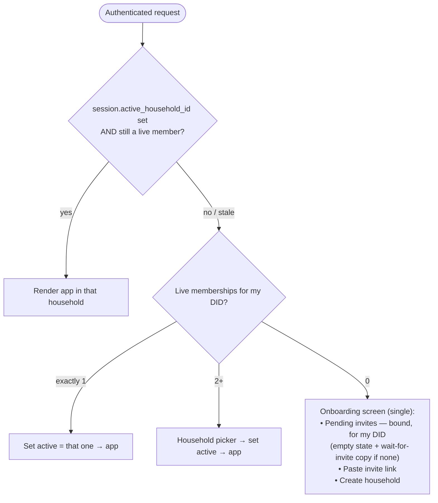
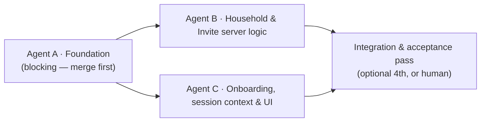

# Plan: Households — the Private-Data Foundation

Status: **spec** (written 2026-07-28). Not yet built.

Goal: introduce the **household** — the multi-tenant boundary that every piece of
private Buttery data will descend from. This project builds the _foundation
only_: the household entity, its membership, invites (bound + open), the
onboarding flows that put a signed-in user into exactly one active household
context, and the single authorization chokepoint all future private features
will pass through.

This is the Postgres/private half described in
[`docs/research/05-private-vs-public-data.md`](../research/05-private-vs-public-data.md).
Read that doc first — it is the _why_. This plan is the _what to build now_.

> **Deliberately narrow.** No recipe box, no saved recipes, no notes, no meal
> plans, no shopping lists, no draft authoring, no notification system, no export
> endpoint in this project. Those are documented as **holes** in [§12](#12-documented-holes--future-deliverables)
> with the exact seams left for them. The point of this project is to get the
> tenancy boundary and its authorization correct so everything downstream is a
> straightforward descent from `household_id`.

---

## 0. Decisions locked (from the planning conversation)

| Question                         | Decision                                                                                                                                                                                                                                                                                                                                                                       |
| -------------------------------- | ------------------------------------------------------------------------------------------------------------------------------------------------------------------------------------------------------------------------------------------------------------------------------------------------------------------------------------------------------------------------------ |
| **Scope**                        | Household infra only: `household`, `household_member`, `household_invite`, onboarding + invite flows, active-household context, `assertMember` chokepoint. **No recipe box / saves / notes / plans this project.**                                                                                                                                                             |
| **First sign-in**                | Sign-in **never** auto-creates a household. Post-login routing decides (see [§5](#5-onboarding--session-state-machine)).                                                                                                                                                                                                                                                       |
| **Accidental-create prevention** | A **single** onboarding screen for users with no live membership: pending invites (with an empty state when there are none), paste-invite-link, and create-household. Copy nudges toward waiting for an invite over creating. No persisted "I'm waiting" state, no `awaiting_invite_since` flag. Bound invites for the user's DID auto-surface in the pending-invites section. |
| **Roles**                        | `owner` and `member` only. Role column is **free text** so more roles slot in later without a migration.                                                                                                                                                                                                                                                                       |
| **Owner invariant**              | A household always has **≥1 owner**. Multiple owners allowed. An owner may leave freely _if another owner remains_; the **last owner is blocked** from leaving until they promote someone or the household is otherwise emptied.                                                                                                                                               |
| **Who can invite / remove**      | **Owners only** create invites, remove members, promote/demote, rename, and delete the household. Members read+write household data only.                                                                                                                                                                                                                                      |
| **Invite role**                  | Invite carries a `role` (default `member`). Only an **owner-minted** invite may grant `role='owner'`.                                                                                                                                                                                                                                                                          |
| **Invite binding**               | Support **both**: DID-bound direct invites (`bound_to_did` set) and open token links (`bound_to_did` NULL, governed by `max_uses` + `expires_at`).                                                                                                                                                                                                                             |
| **Invite token storage**         | Store the **hash** of the token, never the raw token. Raw token exists only in the shareable link.                                                                                                                                                                                                                                                                             |
| **Account key**                  | **DID everywhere.** No handle joins for authorization. `handle` is a denormalized cache only.                                                                                                                                                                                                                                                                                  |
| **Active household**             | Stored on the **better-auth `session`** as `active_household_id` (via better-auth `additionalFields`). Validated against membership on every request.                                                                                                                                                                                                                          |
| **Multiple households**          | Allowed, no hard cap. **Soft-warn** (confirm dialog) when a user who is already in a household creates another.                                                                                                                                                                                                                                                                |
| **Account deletion of a member** | Soft-delete the membership, retain the row attributed to a **tombstoned DID**. If the deleter was the sole owner, the owner-exit rule fires. Detection wiring is a documented hole (no lifecycle-event feed yet); intended behavior is specified now.                                                                                                                          |
| **Table naming**                 | Plain `snake_case` (`household`, not `_household`) — matches existing buttery app tables (`recipe`, `recipe_ingredient`). The "never leaves Buttery" meaning is carried by docs + the migration docstring, not a prefix.                                                                                                                                                       |
| **Record-shaping**               | Stable **ULID** `id` + normal typed columns. **No** `value jsonb` mirror and **no** Lexicon schema files this project. Deferral to the future atproto "spaces" migration is documented, not built.                                                                                                                                                                             |
| **Email notifications**          | **Call-site TODOs only.** No outbox table, no `Notifier` interface. Mark every spot where email would fire ([§11](#11-email-notification-seams)).                                                                                                                                                                                                                              |
| **Export endpoint**              | Deferred. Shape documented as a required future deliverable ([§12](#12-documented-holes--future-deliverables)).                                                                                                                                                                                                                                                                |

---

## 1. Scope

### In scope (build)

- Three tables: `household`, `household_member`, `household_invite`.
- One better-auth `additionalField`: `session.active_household_id`.
- The `assertMember(did, householdId, minRole)` authorization chokepoint and a
  Kysely membership-join helper.
- Server functions for: onboarding resolution, create household, accept/decline
  invite, create/revoke invite, list/rename household, leave, remove member,
  promote/demote, switch active household.
- The single onboarding screen, an in-app "households" management surface, and
  the invite-acceptance route.

### Out of scope (holes left, see [§12](#12-documented-holes--future-deliverables))

`saved_recipe` (recipe box), `recipe_note`, meal-plan / `plan_entry`,
`shopping_item`, draft authoring, notification/email delivery, JSON export
endpoint, custom Lexicon schemas, account-lifecycle event ingestion, atproto
"spaces" migration.

---

## 2. Architecture overview

```mermaid
flowchart TD
    login["atproto OAuth sign-in<br/>(existing better-auth plugin)"] --> resolve

    subgraph web["services/web — TanStack Start server functions"]
        resolve["Onboarding resolver<br/>live membership? which / how many?"]
        resolve -->|has membership| active["Set/confirm active_household_id on session"]
        resolve -->|no membership| onboard["Onboarding screen:<br/>• Pending invites (bound, for my DID) — empty state if none<br/>• Paste invite link<br/>• Create household (copy nudges: wait for an invite)"]

        active --> chokepoint
        onboard --> chokepoint

        chokepoint["assertMember(did, householdId, minRole)<br/>· the ONE authz gate ·<br/>every household-scoped read/write passes here"]
    end

    chokepoint -->|Kysely membership join| db[("Railway Postgres<br/>household · household_member · household_invite")]

    note["Future private tables (saved_recipe, plan_entry, …)<br/>all carry household_id and pass through assertMember"] -.descends from.-> db
```



Principles carried from the research doc:

- **DID is the only identity key** for authorization. `handle` is cache.
- **One authorization chokepoint.** It is impossible to read/write
  household-scoped data without going through `assertMember` in a server
  function. Never authorize in the client.
- **Split by future space-type.** These three tables are the household _spine_.
  Future resource families (saves, notes, plans) are their own tables that
  reference `household_id`; they are not a monolithic blob.
- **Every future private row will carry `household_id`.** No orphans. The rule
  "any private/unpublished recipe MUST belong to a household" is enforced by the
  fact that the only write path for private data is behind `assertMember`, which
  requires a household.

---

## 3. Data model

All timestamps `timestamptz`. IDs are **ULID** stored as `text`. `snake_case`
tables. These enter the existing web Kysely migration pipeline (`services/web/src/db/migrations/`,
epoch-ms-prefixed filename, `up`/`down`, `Kysely<any>`), as one new migration
whose timestamp is greater than `1785300000000`. After the migration, regenerate
`services/web/src/db/types.ts` via `kysely-codegen` — do not hand-edit it.

### 3.1 `household`

| Column           | Type                               | Notes                                        |
| ---------------- | ---------------------------------- | -------------------------------------------- |
| `id`             | `text` PK                          | ULID, minted app-side                        |
| `name`           | `text` NOT NULL                    | user-provided; onboarding suggests a default |
| `created_by_did` | `text` NOT NULL                    | the founding owner's DID                     |
| `created_at`     | `timestamptz` NOT NULL default now |                                              |
| `updated_at`     | `timestamptz` NOT NULL default now |                                              |
| `deleted_at`     | `timestamptz` NULL                 | soft-delete; NULL = live                     |

- No FK from `created_by_did` to `user` — DIDs may exist before a Buttery `user`
  row (a bound invite can name a DID that has never logged in). DID is the
  durable key, `user` is incidental.
- A partial index on `(id) WHERE deleted_at IS NULL` for live lookups.

### 3.2 `household_member`

| Column           | Type                               | Notes                                                 |
| ---------------- | ---------------------------------- | ----------------------------------------------------- |
| `household_id`   | `text` NOT NULL                    | → `household.id`                                      |
| `did`            | `text` NOT NULL                    | the member's atproto DID                              |
| `role`           | `text` NOT NULL                    | `'owner'` \| `'member'` (free text, extensible)       |
| `joined_at`      | `timestamptz` NOT NULL default now |                                                       |
| `invited_by_did` | `text` NULL                        | who added them (NULL for the founder)                 |
| `deleted_at`     | `timestamptz` NULL                 | soft-delete (member removed / left / account-deleted) |
| `tombstoned`     | `boolean` NOT NULL default false   | true when retained for a deleted atproto account      |

- **Primary key `(household_id, did)`.** A DID appears at most once per
  household.
- Index on `did` for "which households am I in" lookups.
- Index on `(household_id) WHERE deleted_at IS NULL AND role = 'owner'` to make
  the ≥1-owner invariant check cheap.
- `role` is intentionally not a Postgres enum — adding `viewer`/`adult` later
  must not require a migration.

### 3.3 `household_invite`

| Column           | Type                                | Notes                                                                                                           |
| ---------------- | ----------------------------------- | --------------------------------------------------------------------------------------------------------------- |
| `id`             | `text` PK                           | ULID                                                                                                            |
| `token_hash`     | `text` NOT NULL UNIQUE              | hash of the raw token (see [§6.1](#61-token--hashing))                                                          |
| `household_id`   | `text` NOT NULL                     | → `household.id`                                                                                                |
| `role`           | `text` NOT NULL default `'member'`  | role granted on acceptance                                                                                      |
| `created_by_did` | `text` NOT NULL                     | must be an owner at creation time                                                                               |
| `bound_to_did`   | `text` NULL                         | set = only this DID may accept; NULL = open link                                                                |
| `max_uses`       | `int` NOT NULL default 1            | open links may raise; bound invites are 1                                                                       |
| `uses`           | `int` NOT NULL default 0            | incremented on each acceptance                                                                                  |
| `expires_at`     | `timestamptz` NULL                  | NULL = no expiry (discouraged; UI sets one)                                                                     |
| `created_at`     | `timestamptz` NOT NULL default now  |                                                                                                                 |
| `revoked_at`     | `timestamptz` NULL                  | owner revoked the invite                                                                                        |
| `status`         | `text` NOT NULL default `'pending'` | `pending` \| `accepted` \| `declined` \| `revoked` \| `expired` (derived-but-materialized for query simplicity) |

- Who redeemed an open (multi-use) invite is recorded on the resulting
  `household_member.invited_by_did`, not on the invite row — so no
  `accepted_by_did` column (it can't represent `max_uses > 1`).
- Partial index on `(bound_to_did) WHERE status = 'pending' AND bound_to_did IS NOT NULL`
  — this is the query that auto-surfaces pending bound invites on login.
- `status` is a materialized convenience: acceptance/decline/revoke set it
  directly; expiry is computed on read (`expires_at < now()`) **and** may be
  lazily written by a sweep later. Treat `expires_at < now()` as authoritative
  for gating regardless of the stored `status`.

### 3.4 better-auth `additionalField`

The atproto plugin already extends `user` with `did`/`handle`. Add via
better-auth config (not a raw column-only migration — better-auth must know the
field to persist/read it):

- **`session.active_household_id`** `text` NULL — the household the UI is
  currently scoped to. Set on join/create/switch. Validated every request.

> **Executor note:** confirm better-auth's TanStack Start adapter supports
> `session` `additionalFields` in this version; the plugin already demonstrates
> `user` extension. If session additionalFields are not cleanly supported,
> fall back to a `user_active_household` app table keyed by `user_id` (still
> "device-global per user", same semantics) and mirror to a signed cookie for
> fast server-fn reads. Document whichever path is taken.

---

## 4. Authorization chokepoint

The single most important deliverable. **Every** household-scoped read and write
— now and forever — passes through this.

### 4.1 `assertMember`

Conceptual signature (server-only module, e.g. `services/web/src/lib/household/authz.ts`):

```
assertMember(did: string, householdId: string, minRole: Role = 'member'): Promise<Membership>
```

Behavior:

1. Look up a **live** (`deleted_at IS NULL`, not `tombstoned`)
   `household_member` for `(householdId, did)` whose parent `household` is live
   (`deleted_at IS NULL`).
2. If none → throw `NotAMemberError` (server functions translate to 403/redirect
   to onboarding).
3. If found but `role` rank `< minRole` rank → throw `InsufficientRoleError`.
   Role rank: `owner (2) > member (1)`.
4. Return the membership row for the caller to use.

- `did` comes from the **server-validated session** only, never a client
  argument.
- `householdId` is resolved from `session.active_household_id` (default) or an
  explicit argument for cross-household operations (e.g. accepting an invite to a
  household you're not yet active in).

### 4.2 Kysely membership-join helper

Provide a query-builder helper that makes it hard to write a household-scoped
query _without_ the membership join, e.g. a
`householdScopedQuery(db, did, householdId)` that returns a builder already
constrained by a join to a live `household_member` for `(householdId, did)`.
Future feature tables (`saved_recipe`, …) are meant to be queried through this
helper so a forgotten `WHERE household_id =` can't leak another tenant's data.

Document the pattern in the module so downstream agents copy it rather than
hand-rolling scoped queries.

---

## 5. Onboarding & session state machine

Runs immediately after a successful atproto sign-in, on every authenticated page
load (a router `beforeLoad` / server-fn guard), _before_ rendering any
household-scoped UI.



Rules:

- **Stale active household** (household deleted, or membership removed/tombstoned
  while active) → clear `active_household_id`, re-run resolution. Never render
  against a household the caller is no longer a live member of.
- **No-membership users land on the single onboarding screen.** It has three
  parts: (a) **Pending invites** — bound invites for the caller's DID, auto-
  surfaced; when there are none, an empty state whose copy encourages waiting for
  an invite rather than creating; (b) **Paste invite link** — for open links;
  (c) **Create household** — always available, but visually secondary and
  wrapped in copy that nudges toward waiting.
- **Accepting any invite** (bound or pasted open link) → set
  `active_household_id` to the joined household.
- **Multi-household picker**: appears only for 2+ live memberships. After first
  selection, `active_household_id` sticks; the picker is reachable later from the
  household-switcher UI.

### Accidental-creation guardrails (explicit requirement)

1. Sign-in never creates a household.
2. Pending **bound** invites render above the create action on the onboarding
   screen; the empty-state copy nudges toward waiting.
3. Create is visually secondary to accepting an invite, but never hidden — no
   sticky "waiting" state to escape from.
4. Creating a **second** household when already a live member of one triggers a
   confirm dialog ("You're already in _X_. Most people only need one. Create
   another?"). No hard cap.

---

## 6. Invite lifecycle

### 6.1 Token & hashing

- Generate a high-entropy random token (e.g. 32 bytes, URL-safe base64). The
  **raw** token appears only in the shareable link (`/invite/<token>` or a query
  param — pick one and document it).
- Store `token_hash = hash(token)` (a fast cryptographic hash such as SHA-256 is
  sufficient here; the token is high-entropy, so slow KDFs are unnecessary).
  **Never store the raw token.**
- Lookups hash the presented token and match `token_hash`.

### 6.2 Creating an invite (owners only)

Preconditions checked in the server function:

- `assertMember(callerDid, householdId, 'owner')`.
- If `role='owner'` requested → allowed (caller is already owner). `member` is
  the default.
- **Bound invite**: caller supplies a handle → resolve to DID (reuse the atproto
  handle→DID resolution already in the auth plugin). Set `bound_to_did`,
  `max_uses = 1`. The target DID need not have a Buttery account yet; the invite
  surfaces on their first login.
- **Open invite**: `bound_to_did = NULL`, caller sets `max_uses` (default a small
  number, UI-capped) and `expires_at` (UI requires one; default e.g. 7 days).

Returns the shareable link containing the raw token. **TODO(email):** if a bound
handle resolves to a DID with a known contact path, this is where a transactional
invite email would send ([§11](#11-email-notification-seams)).

### 6.3 Accepting an invite

The acceptance server function validates **in this order**, failing closed:

1. Token hashes to an existing invite → else `InvalidInvite`.
2. `revoked_at IS NULL` and `status = 'pending'` → else `InviteRevoked` / already
   resolved.
3. `expires_at IS NULL OR expires_at > now()` → else `InviteExpired`.
4. `uses < max_uses` → else `InviteExhausted`.
5. If `bound_to_did IS NOT NULL`: the **session DID must equal `bound_to_did`** →
   else `InviteNotForYou`. (An open link skips this.)
6. Parent `household` is live → else `InviteHouseholdGone`.
7. Caller is **not already a live member** of the household → else treat as
   idempotent success (just set active), do not create a duplicate row / consume
   a use.

On success (atomically, in one transaction):

- Insert `household_member (household_id, did=sessionDid, role=invite.role,
invited_by_did=invite.created_by_did)`. If a soft-deleted membership row
  exists for this `(household_id, did)`, **revive it** (clear `deleted_at`,
  `tombstoned`, reset role to the invite's) rather than violating the PK.
- `uses += 1`. If `uses >= max_uses`, set `status = 'accepted'` (bound invites
  and single-use links flip immediately; multi-use links stay `pending` until
  exhausted).
- Set `session.active_household_id = household_id`.

### 6.4 Declining a bound invite

- Only meaningful for bound invites (an open link has nobody to decline for).
- Set `status = 'declined'`. The invitee returns to the single onboarding screen
  (they may still create or wait for another invite).
- A declined bound invite no longer auto-surfaces in the pending-invites section.

### 6.5 Revoking (owners only)

- `assertMember(callerDid, householdId, 'owner')`; set `revoked_at = now()`,
  `status = 'revoked'`. Subsequent acceptance attempts fail at step 2.

---

## 7. Household management operations

All gated by `assertMember` at the stated `minRole`. All are server functions.

| Operation               | minRole                  | Notes / invariants                                                                                                                                                                                                                                        |
| ----------------------- | ------------------------ | --------------------------------------------------------------------------------------------------------------------------------------------------------------------------------------------------------------------------------------------------------- |
| Create household        | (none — any authed user) | Insert `household` + an `owner` `household_member` for the creator in one tx. Soft-warn if caller already in a live household.                                                                                                                            |
| Rename household        | `owner`                  | `name`, bump `updated_at`.                                                                                                                                                                                                                                |
| Create invite           | `owner`                  | [§6.2](#62-creating-an-invite-owners-only).                                                                                                                                                                                                               |
| Revoke invite           | `owner`                  | [§6.5](#65-revoking-owners-only).                                                                                                                                                                                                                         |
| Remove member           | `owner`                  | Soft-delete target membership (`deleted_at = now()`). Cannot remove the **last owner** (see invariant). Removing yourself = "leave".                                                                                                                      |
| Promote to owner        | `owner`                  | Set target `role = 'owner'`.                                                                                                                                                                                                                              |
| Demote owner → member   | `owner`                  | Allowed only if **another live owner remains** after demotion.                                                                                                                                                                                            |
| Leave household         | `member` (self)          | Soft-delete own membership. If caller is the **last live owner** → **blocked** with a clear error ("Promote another owner or delete the household first").                                                                                                |
| Delete household        | `owner`                  | Soft-delete `household` (`deleted_at`). Soft-delete all live memberships. Revoke all pending invites. Any active sessions pointed here get `active_household_id` cleared on next request (stale-active rule, [§5](#5-onboarding--session-state-machine)). |
| Switch active household | member of target         | Validate live membership, set `session.active_household_id`.                                                                                                                                                                                              |

### 7.1 Owner invariant enforcement

A single guard used by _leave_, _remove member_, and _demote_:

> The count of live (`deleted_at IS NULL`, not `tombstoned`) `owner` memberships
> for a household must never drop below 1 while the household is live.

Implement as a check inside the mutating transaction (count owners excluding the
one being removed/demoted; abort if it would reach 0). Prefer a transactional
check over a DB constraint — the rule spans rows and role transitions.

### 7.2 Account deletion of a member

Intended behavior (detection is a hole — see [§12](#12-documented-holes--future-deliverables)):

- Soft-delete the membership (`deleted_at = now()`) and set `tombstoned = true`,
  retaining the row attributed to the (now dead) DID for history/audit.
- If the deleted account was the **sole owner** of a household, apply the
  owner-exit rule: because there is no other owner to auto-promote and the
  invariant would break, the household is left ownerless **only** in the
  tombstoned sense — specify that such a household is **soft-deleted** (no live
  owner can exist, so the household cannot be administered). Document this as the
  chosen resolution; revisit if auto-promote-on-death is later desired.

---

## 8. Active-household context

- Source of truth: `session.active_household_id` (or the fallback table per the
  [§3.4](#34-better-auth-additionalfield) executor note).
- **Resolved and re-validated on every authenticated request** against a live
  membership. A stale/removed/deleted pointer is cleared and resolution re-runs.
- The UI always displays which household is active (a switcher in the app chrome).
  Because being in 2+ households is extremely unlikely, the switcher may be
  minimal — but the active household must be unambiguous and explicit at all
  times.
- No household id in URLs this project (session-attached decision). Downstream
  features read the active household from the server-validated session, not from
  route params.

---

## 9. Server-function surface (contract)

Name-level contract for executing agents (TanStack `createServerFn`, server-only,
each begins by resolving the session DID and — where household-scoped — calling
`assertMember`):

- `resolveOnboarding()` → the state-machine verdict for the current user
  (`{ kind: 'active' | 'pick' | 'onboard', ... }`). The `onboard` payload carries
  the caller's pending bound invites so the screen can render them (or the empty
  state) in one round-trip.
- `createHousehold({ name })`
- `renameHousehold({ householdId, name })`
- `listMyHouseholds()` → live memberships + household summaries.
- `switchActiveHousehold({ householdId })`
- `leaveHousehold({ householdId })`
- `removeMember({ householdId, did })`
- `setMemberRole({ householdId, did, role })` (promote/demote; enforces invariant)
- `deleteHousehold({ householdId })`
- `createInvite({ householdId, role?, boundHandle?, maxUses?, expiresAt? })` →
  `{ link }`
- `revokeInvite({ inviteId })`
- `listInvites({ householdId })` (owners only)
- `getInvitePreview({ token })` → public-ish preview (household name, inviter
  handle) for the acceptance screen; does **not** consume a use.
- `acceptInvite({ token })`
- `declineBoundInvite({ token })`

Errors are typed (`NotAMemberError`, `InsufficientRoleError`, `InvalidInvite`,
`InviteExpired`, `InviteExhausted`, `InviteNotForYou`, `InviteRevoked`,
`LastOwnerError`, …) so the UI can branch cleanly.

---

## 10. UI surface

Routes (TanStack file-based, under the existing `services/web/src/routes/`; exact
paths at executor discretion, documented on build):

- **Onboarding** — the single screen for no-membership users: pending bound
  invites (empty state + wait-for-invite copy when none) · paste invite link ·
  create household (secondary).
- **Invite acceptance** — `/invite/<token>`: renders `getInvitePreview`, then
  Accept / Decline. Works whether or not the visitor is logged in (prompt to
  sign in first; the token survives the auth round-trip).
- **Household picker** — shown only for 2+ memberships.
- **Household management** — members list (roles, remove, promote/demote for
  owners), invite creation + pending-invite list (owners), rename, delete,
  leave. A minimal active-household switcher in app chrome.

All household-scoped screens fetch through server functions behind
`assertMember`; the client never decides authorization.

---

## 11. Email notification seams

No email system this project. Leave a **call-site `TODO(email)`** comment (and a
one-line spec note) at exactly these points, so a later notification project has
an inventory:

- Invite created (bound) → notify the invited handle/DID. ([§6.2](#62-creating-an-invite-owners-only))
- Invite accepted → notify the inviting owner. ([§6.3](#63-accepting-an-invite))
- Member removed → notify the removed member.
- Promoted to owner → notify the promoted member.
- Household deleted → notify remaining members.

No table, no interface, no dispatcher — just the marked seams.

---

## 12. Documented holes & future deliverables

Each is intentionally **not** built now but must be trivially attachable to this
foundation.

| Hole                                                          | Seam left                                                                                                                                                                                                                                         | Notes                                                                                                                                                       |
| ------------------------------------------------------------- | ------------------------------------------------------------------------------------------------------------------------------------------------------------------------------------------------------------------------------------------------- | ----------------------------------------------------------------------------------------------------------------------------------------------------------- |
| **Recipe box / `saved_recipe`**                               | A future table keyed `(household_id, uri)` with `saved_by_did`, `cid`, and denormalized `*_snapshot` columns, queried via the [§4.2](#42-kysely-membership-join-helper) helper.                                                                   | This was in the original ask; deliberately deferred. Research schema at `05-private-vs-public-data.md` §4. Store `at://` URI + CID + snapshot per that doc. |
| **Private notes / `recipe_note`**                             | Same pattern: `household_id` + author DID + target recipe ref.                                                                                                                                                                                    | Distinct authorization family; own table, not a column on `saved_recipe`.                                                                                   |
| **Meal plan / `plan_entry`, shopping list / `shopping_item`** | Own `household_id`-scoped tables.                                                                                                                                                                                                                 | Split-by-space-type (research Diary 6).                                                                                                                     |
| **Draft authoring**                                           | Local recipes already have `recipe.origin='local'` + `recipe.visibility='draft'` columns (migration `1785300000000`). The rule "no orphaned drafts" is satisfied by giving local recipes a `household_id` and writing only behind `assertMember`. | This project does not build draft creation, but establishes the household every future draft must reference.                                                |
| **JSON export endpoint**                                      | A server function emitting the authed user's households + memberships + invites as JSON; extended per-table as private tables land, with `at://` + CID intact once saves exist.                                                                   | Research: "ship export from day one." Deferred by scope decision — **build early in the next project**; it is the trust + GDPR + migration story.           |
| **Custom Lexicon schemas / `value jsonb` record-shaping**     | Not added now. When atproto "spaces" become implementable, revisit: add a `value jsonb` mirror + `exchange.household.*` lexicons so migration is "emit the value into a permissioned repo, keep DB as index."                                     | Research §6 future-proofing checklist. The stable ULID `id` is the one piece kept now.                                                                      |
| **Account-lifecycle event ingestion**                         | No firehose/Tap deactivation/deletion feed is wired. [§7.2](#72-account-deletion-of-a-member) specifies intended behavior; a later project detects the events and calls the tombstone path.                                                       | Research §4 account-lifecycle table.                                                                                                                        |
| **atproto "spaces" migration**                                | The `assertMember` chokepoint is the single module to swap from "Buttery decides" → "space credential decides."                                                                                                                                   | Not before 2027 per research §3.                                                                                                                            |

---

## 13. Migration & naming notes

- One new migration file in `services/web/src/db/migrations/`, epoch-ms prefix
  **greater than** `1785300000000`, `snake_case` descriptive suffix (e.g.
  `<ts>_create_household_tables.ts`). `up`/`down`, `Kysely<any>`, schema builder;
  raw `sql` only for defaults/partial indexes, matching
  `1785110816625_create_sync_index.ts` style.
- The migration docstring must state: **these tables are Buttery-private, never
  written to a PDS**, and DID is the identity key (the meaning the `_`-prefix
  would otherwise carry).
- better-auth `additionalField` (`session.active_household_id`) is declared in
  the better-auth config **and** reflected in the schema. Follow how the atproto
  plugin's `did`/`handle` user fields are already wired.
- Regenerate `services/web/src/db/types.ts` with `kysely-codegen` after
  migrating; never hand-edit it.
- Run migrations with the dev env: `railway run --service buttery -- pnpm db:migrate:up`
  (per project memory).

---

## 14. Edge-case checklist (acceptance criteria)

The build is correct when all of these hold:

1. Fresh user, no invite → single onboarding screen with an empty pending-invites
   state and wait-for-invite copy; no household exists until explicit create.
2. User with a pending **bound** invite → invite auto-surfaces in the onboarding
   screen's pending-invites section, above the create action.
3. Create household is always reachable on the onboarding screen but visually
   secondary; there is no persisted "waiting" state to enter or escape.
4. Accepting a **bound** invite as the wrong DID → rejected (`InviteNotForYou`).
5. Open link: works for any logged-in DID; respects `max_uses` and `expires_at`;
   exhausted/expired links fail closed.
6. Accepting when already a live member → idempotent (no duplicate row, no
   consumed use), active household set.
7. Re-accepting after having been removed (soft-deleted membership) → **revives**
   the row, no PK violation.
8. Last owner tries to leave / be removed / be demoted → blocked
   (`LastOwnerError`).
9. Owner leaves while another owner exists → allowed.
10. Household deleted while a member has it active → that member's next request
    clears `active_household_id` and re-runs onboarding; no render against a dead
    household.
11. Creating a 2nd household while already in one → confirm dialog; proceeds only
    on explicit confirm; no hard cap.
12. Every household-scoped server function rejects a caller who is not a live
    member (`assertMember`), verified by attempting cross-household access.
13. Revoked invite cannot be accepted.
14. `active_household_id` pointing at a household the caller was removed from is
    treated as stale and cleared.
15. Raw invite tokens never appear in the database (only `token_hash`).

---

## 15. Open items for the executor to confirm empirically

- better-auth `session` `additionalFields` support in the pinned version
  ([§3.4](#34-better-auth-additionalfield) fallback if not).
- Handle→DID resolution reuse for bound invites (the auth plugin already
  resolves DID↔handle; confirm the exported surface).
- Whether the invite-acceptance route can carry the token through the atproto
  OAuth round-trip for logged-out visitors (state param or a pre-auth cookie).

---

## 16. Recommended subagents & ownership

Three build agents, each in its own **git worktree**, each producing code only
and merging back into a shared feature branch (created after this division is
approved). File-area boundaries are drawn so worktrees don't collide on merge.

**Merge order is a hard dependency chain at one point:** Agent A must land first
(everything imports its schema, types, authz, and errors). Agents B and C then
branch off the post-A branch and run in parallel against the **frozen contracts**
in [§4](#4-authorization-chokepoint), [§6](#6-invite-lifecycle),
[§7](#7-household-management-operations), and [§9](#9-server-function-surface-contract).



### Agent A — Foundation (blocking; merge before B/C start)

- **Owns (files):** the new migration
  `src/db/migrations/<ts>_create_household_tables.ts`; regenerated
  `src/db/types.ts`; the `session.active_household_id` wiring in `src/lib/auth.ts`
  (and fallback table per [§3.4](#34-better-auth-additionalfield) if needed);
  new `src/lib/household/authz.ts` (`assertMember` + role ranks),
  `src/lib/household/errors.ts` (typed errors), `src/lib/household/scoped-query.ts`
  (Kysely membership-join helper).
- **Delivers:** [§3](#3-data-model) tables + additionalField, [§4](#4-authorization-chokepoint)
  chokepoint + helper, the full typed-error set from [§9](#9-server-function-surface-contract).
- **Definition of done:** migration up/down runs clean via
  `railway run --service buttery -- pnpm db:migrate:up/down`; `types.ts`
  regenerated (not hand-edited); `assertMember` unit-tested for the four outcomes
  (member ok, role-gated, not-a-member, stale/deleted household). Acceptance item
  **12** provable in isolation.
- **Confirms empirically:** the [§15](#15-open-items-for-the-executor-to-confirm-empirically)
  better-auth `session` additionalField question — resolve it here so B and C
  build on a known session shape.

### Agent B — Household & invite server logic

- **Owns (files):** `src/lib/household/households.ts`,
  `src/lib/household/invites.ts`, `src/lib/household/members.ts` (or a single
  cohesive module) — every server function in [§9](#9-server-function-surface-contract)
  **except** `resolveOnboarding` and `switchActiveHousehold` (those are C's, as
  they mutate session context).
- **Delivers:** create/rename/delete household, invite create/revoke/preview/
  accept/decline ([§6](#6-invite-lifecycle)), remove member / setMemberRole /
  leave, the **owner invariant** ([§7.1](#71-owner-invariant-enforcement)) and
  **tombstone** path ([§7.2](#72-account-deletion-of-a-member)). All mutations
  transactional; all gated by `assertMember`.
- **Depends on:** Agent A (authz, errors, scoped-query, schema).
- **Definition of done:** acceptance items **4, 5, 6, 7, 8, 9, 13, 15** covered
  by tests against a real dev DB; `token_hash`-only storage verified (item 15);
  ordered acceptance-validation ([§6.3](#63-accepting-an-invite)) exercised for
  each failure branch.
- **Email seams:** drops the `TODO(email)` call-site markers from
  [§11](#11-email-notification-seams) at its mutation points.

### Agent C — Onboarding, session context & UI

- **Owns (files):** all new routes under `src/routes/**` (onboarding screen,
  `/invite/<token>` acceptance, household-management surface, switcher);
  `src/lib/household/onboarding.ts` (`resolveOnboarding`,
  `switchActiveHousehold`, active-household resolution + per-request
  stale-validation middleware/guard).
- **Delivers:** the single onboarding screen ([§5](#5-onboarding--session-state-machine),
  [§10](#10-ui-surface)) with the pending-invites/empty-state/paste-link/
  secondary-create layout and wait-for-invite copy; multi-household picker;
  invite-acceptance route surviving the OAuth round-trip; active-household
  context wiring ([§8](#8-active-household-context)).
- **Depends on:** Agent A (session field, authz) and Agent B's **server-function
  contracts** ([§9](#9-server-function-surface-contract)). Code against the
  contract; integrate against B's merged output.
- **Definition of done:** acceptance items **1, 2, 3, 10, 11, 14** demonstrable
  in the running app; no household-scoped screen renders without passing
  `assertMember`; stale-active pointer clears and re-resolves on next request.
- **Confirms empirically:** the invite-token-through-OAuth question from
  [§15](#15-open-items-for-the-executor-to-confirm-empirically).

### Optional Agent D — Integration & acceptance

- After B and C merge, one pass that runs the **full [§14](#14-edge-case-checklist-acceptance-criteria)
  checklist** end-to-end against the running app + dev DB, files any gaps, and
  fixes seams between B's server logic and C's UI. May be folded into the human
  merge review instead of a separate agent.

### Boundaries that keep worktrees merge-clean

- `src/lib/auth.ts` and `src/db/types.ts` are touched **only by A**.
- `src/lib/household/{authz,errors,scoped-query}.ts` — **A only**;
  `{households,invites,members}.ts` — **B only**; `onboarding.ts` — **C only**.
- `src/routes/**` — **C only**.
- B and C never edit the same file; both consume A's exports read-only.
