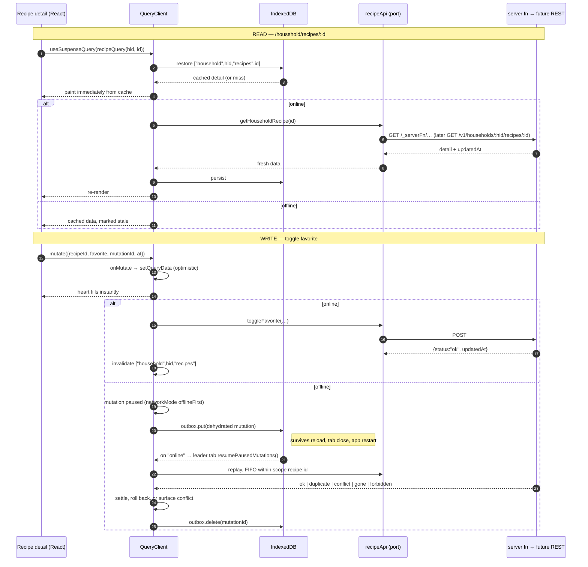
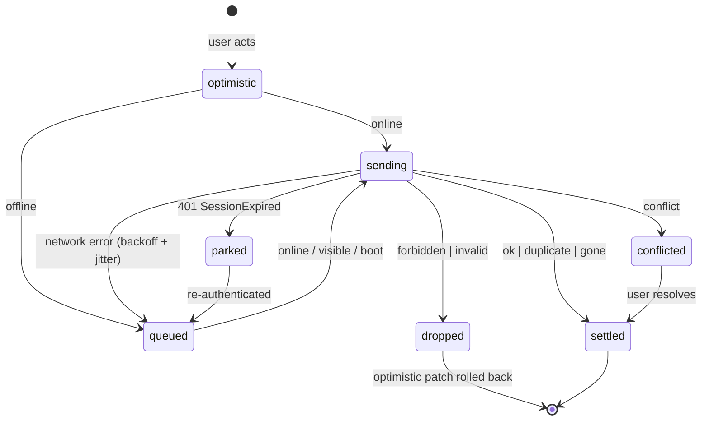

# 2026-08-11 — Offline mode (offline-capable PWA)

Status: **spec / pre-development**
Depends on: `03-household-recipe-collection.md` (the box + rendered `recipe` layer),
`2026-08-06-meal-planner.md` (`meal_plan_entry`, the optimistic-patch system),
`2026-08-09-paprika-import.md` (the `ImportApi` port — the pattern §5 generalizes),
`05-cook-mode.md` (the client-persistence idioms, the PWA seam in `lib/timers/alarm-delivery.ts`).

> Implementer: log outcomes to `docs/plans/results/2026-08-11-offline-mode-results.md`
> (what was built, how it was verified, deliberate deviations).

---

## 1. Overview

Buttery is a kitchen app. Kitchens have bad wifi, phones go in pockets on the way to the
grocery store, and cook mode runs for 90 minutes on a counter. The app currently cannot
survive a single dropped packet: every screen is a route `loader` calling a
`createServerFn`, every write is a direct RPC followed by `router.invalidate()`, and there
is no client cache of any kind. Offline is not a feature that can be bolted on later — it
decides how data is fetched, how mutations are shaped, and what the server has to record.
That is why this is being planned now, before more surface accumulates.

This plan does three things:

1. **Installs a real client cache.** TanStack Query becomes the single owner of server
   state, persisted to IndexedDB. Router loaders prime it; components read it.
2. **Makes the app installable and shell-offline.** A web app manifest, a service worker
   built alongside the SSR bundle, and iOS-specific handling so an installed Buttery keeps
   its data instead of being evicted after seven days.
3. **Makes a curated set of writes survive being offline** — favorites, notes, meal-plan
   edits — through a durable outbox with idempotency keys and per-entity conflict policies.

It also establishes, deliberately and in writing, **what changes about how we talk to the
server** so that extracting a standalone API service later is a transport swap and not a
rewrite (§5). Building that service is out of scope. Making it cheap is not.

### 1.1 In scope

1. Full adoption of `@tanstack/react-query` + `@tanstack/react-router-ssr-query` as the app's
   one cache, replacing loader-owned data everywhere (§4).
2. A client-side API port layer (`src/lib/api/**`) — the only place in client code allowed to
   import `#/server/**` — with a query-key namespace that is a future REST URL namespace (§5).
3. IndexedDB persistence of query results, partitioned by `(did, householdId)` and wiped on
   sign-out or household switch (§6).
4. A **low-priority background mirror** that fills the local copy of the recipe box behind an
   observable "X of Y recipes synced" progress surface (§7).
5. A durable **outbox** for a curated write set, replayed on reconnect, idempotent by
   client-minted mutation id (§8).
6. **Conflict handling**: `updated_at` plumbing, optimistic concurrency on the shared note
   with a real resolution surface, and last-write-wins with clock-skew clamping everywhere
   else (§9).
7. Schema: `mutation_log`, `household_recipe.updated_at` (§10).
8. **PWA**: manifest wired up (it exists in `public/` and is linked from nowhere), a service
   worker built for the srvx/SSR output, an install prompt, an offline shell route (§11).
9. iOS-specific readiness work — eviction, quota, the missing Background Sync API (§12).

### 1.2 Out of scope (seams only)

- **The standalone API service.** Not built. §5 is the complete list of what this plan does
  differently so that building it later is a one-adapter change.
- **Offline recipe authoring, Paprika import, and publishing.** `saveRecipe`,
  `commitImportChunk`, and `publishRecipe` stay online-only (§8.4). They touch blob storage
  and atproto, and an unsent draft lost to Safari's evictor is worse than a disabled button.
- **Real-time sync / CRDTs / a replication protocol.** No Electric, no PowerSync, no RxDB.
  The server stays authoritative; the client holds a disposable cache (§2.1).
- **Web Push for timer alarms.** The seam is already marked at `src/lib/timers/alarm-delivery.ts:6-10,74`
  and this plan makes it possible (an installed PWA on iOS 16.4+ can receive push) without
  taking it.
- **Background Sync API.** Not available in Safari at all (§12.3). The outbox drains from the
  page, and that is a permanent design constraint, not a temporary one.
- **Cross-tab query broadcasting.** Only the outbox needs a leader (§6.5). Query results
  reconcile naturally through IndexedDB.

---

## 2. Principles that constrain this design

### 2.1 The server is truth; the local copy is disposable

Every byte in IndexedDB must be reconstructible from the server. This is not a philosophical
position, it is an iOS requirement: Safari evicts script-writable storage and refuses
`navigator.storage.persist()`, so any design where the browser holds the only copy of user
data will eventually lose that data on someone's phone. The one exception is the outbox, and
§8 spends its complexity budget on keeping that window short.

### 2.2 The service worker caches the app. TanStack Query caches the data. No overlap.

The service worker handles HTML, JS, CSS, and images. It **never** caches `/_serverFn/*` or
`/api/auth/*`. Data staleness has exactly one owner, with one set of rules, visible in one
devtools panel. A service worker quietly serving a stale JSON response that Query believes is
fresh is the single worst failure mode available here, and this rule makes it structurally
impossible.

### 2.3 One cache owner

Today `defaultPreloadStaleTime: 0` (`src/router.tsx:10`) means the router re-fetches on every
intent preload; the router match cache is the only cache. After §4 the router keeps that
setting *permanently* and stops caching entirely — loaders call `ensureQueryData` and
components call `useSuspenseQuery`. `router.invalidate()` stops being an invalidation
mechanism; `queryClient.invalidateQueries` replaces it.

### 2.4 `householdId` in a query key is a cache partition, never an authorization input

The server derives the active household from `session.active_household_id` and never accepts
it as a client argument (`src/server/recipe-context.ts:8`). That does not change. But the
*client* must know which household a cached row belongs to, or switching households serves
one household's recipes to another — a privacy failure, not a cache bug. So `householdId`
appears in every key and in no validator. The rule is written into the port layer and tested.

### 2.5 Every offline-capable mutation is replayable

A queued mutation may be delivered twice (tab reload mid-flight, retry after an ambiguous
timeout). Every one carries a client-minted ULID `mutationId`; the server records it in
`mutation_log` and returns the prior result on a repeat. Idempotency is not an optimization
here, it is a correctness requirement — and it is exactly what an `Idempotency-Key` header
needs later (§5).

### 2.6 Offline-capable mutations return result unions; they never throw a redirect

`throw redirect({ to: "/login" })` inside `requireSessionDid()` is fine for a loader and
hostile to a replayed mutation — there is no navigation to perform, and the thrown object
does not survive a transport boundary. Offline-capable mutations return a discriminated union
(§8.7). Reads keep the redirect behavior.

### 2.7 Nothing exists only in IndexedDB except the outbox

Corollary of §2.1, stated separately because it is the rule that decides what is allowed to
be offline-writable (§8.4). A queued favorite is a recoverable loss. A queued 40-minute
recipe transcription is not.

### 2.8 Household stays the minimum privacy scope

The cache is partitioned by `(did, householdId)` and wiped on sign-out, household switch, and
on any `forbidden` result from the server (you were removed from the household while
offline). A shared family iPad must not leak one household's box into another's.

---

## 3. Why this stack

The requirement was "most battle-tested, IndexedDB, iOS-ready, plays well with react-query,
prefer a TanStack solution." Those pull in slightly different directions, and here is where
they land.

| Option | Verdict |
|---|---|
| **TanStack Query + `experimental_createQueryPersister` (IndexedDB via `idb-keyval`) + persisted mutations** | **Chosen.** The persister and the paused-mutation/`resumePausedMutations` machinery are first-party, documented for exactly this, and years old. `@tanstack/react-router-ssr-query` is already declared in `services/web/package.json:41` and unused — the integration was clearly anticipated. |
| **TanStack DB 0.6** (`persistedCollectionOptions`) | Rejected for now. It is the strategically interesting answer — live queries, real optimistic transactions, `queryCollectionOptions` wraps Query — but 0.6 standardized persistence on **SQLite (WASM in the browser)**, not IndexedDB, its SSR story is undocumented, and it is pre-1.0. §17 keeps it as an explicit re-evaluation point: the port layer in §5 and the key namespace are what make swapping to it a contained change. |
| **`@tanstack/offline-transactions`** | Rejected as a dependency, adopted as a design source. It is TanStack DB-coupled, but its outbox model — persist before dispatch, FIFO per scope, leader election for multi-tab, exponential backoff with jitter — is exactly right and §8 reimplements that shape on Query's own mutation cache. |
| **RxDB / PowerSync / ElectricSQL** | Rejected. Real replication protocols for a problem we do not have. RxDB's IndexedDB and OPFS storages are paid; all three want to own the data model. Buttery's server is Postgres behind authz joins, not a syncable log. |
| **Hand-rolled IndexedDB cache under the existing loaders** | Rejected. Re-invents staleness, gc, request dedupe, retry, paused mutations, and devtools, with no ecosystem. |
| **`vite-plugin-pwa` / Serwist for the service worker** | Rejected as-is. TanStack Start's Vite plugin replaces the build step these rely on; the community consensus in TanStack/router#4770 is a custom plugin. §11.2 takes that route, made simpler by Buttery serving from `dist/client` under srvx rather than nitro's `.output/public`. |

New direct dependencies: `@tanstack/react-query` (promote from transitive 5.101.2),
`@tanstack/react-query-persist-client`, `@tanstack/react-query-devtools`, `idb-keyval`.
Per AGENTS.md, `pnpm add` needs `CI=true` and the sandbox disabled.

---

## 4. P0 — TanStack Query becomes the one cache

This phase ships **no offline behavior**. It is a pure refactor with its own acceptance
criteria, and everything after it is additive.

### 4.1 Router setup

`src/router.tsx` grows a `QueryClient` in context and the SSR integration:

```ts
import { QueryClient } from "@tanstack/react-query";
import { setupRouterSsrQueryIntegration } from "@tanstack/react-router-ssr-query";

export function getRouter() {
  const queryClient = new QueryClient({
    defaultOptions: {
      queries: {
        staleTime: 30_000,
        gcTime: 1000 * 60 * 60 * 24, // survive a day so IDB restore has something to hold
        retry: (count, err) => !isSessionExpired(err) && count < 3,
        // networkMode + persister are attached in P2; P0 leaves defaults.
      },
    },
  });

  const router = createTanStackRouter({
    routeTree,
    context: { queryClient },
    scrollRestoration: true,
    defaultPreload: "intent",
    defaultPreloadStaleTime: 0, // §2.3 — Query owns caching, the router owns none
    defaultNotFoundComponent: NotFound,
  });

  setupRouterSsrQueryIntegration({ router, queryClient });
  return router;
}
```

`__root.tsx` moves to `createRootRouteWithContext<{ queryClient: QueryClient }>()`.

### 4.2 The query-key namespace *is* the future URL namespace

`src/lib/api/keys.ts`. Every key is resource-shaped and carries its partition. This table is
the contract §5 depends on:

| Key | Today | Future REST |
|---|---|---|
| `["me","households"]` | `listMyHouseholds()` | `GET /v1/me/households` |
| `["household",hid,"recipes"]` | `listHouseholdRecipes()` | `GET /v1/households/:hid/recipes` |
| `["household",hid,"recipes",id]` | `getHouseholdRecipe({recipeId})` | `GET /v1/households/:hid/recipes/:id` |
| `["household",hid,"plan",week]` | `getMealPlanWeek({week})` | `GET /v1/households/:hid/plan?week=` |
| `["household",hid,"members"]` | `listHouseholdMembers()` | `GET /v1/households/:hid/members` |
| `["household",hid,"preferences"]` | `getHouseholdPreferences()` | `GET /v1/households/:hid/preferences` |
| `["recipes","public","recent"]` | `listRecentRecipes()` | `GET /v1/recipes?sort=recent` |
| `["recipes","public",id]` | `getRecipe(id)` | `GET /v1/recipes/:id` |
| `["search","global",q,cursor]` | `searchGlobalRecipes()` | `GET /v1/recipes/search?q=` |

Invalidation becomes prefix-scoped and cheap: a favorite toggle invalidates
`["household",hid,"recipes"]`, not the entire router.

### 4.3 The port layer

Generalize the pattern already proven in `src/lib/recipe-import/api.ts` and its doc comment
("swapping the transport is one file") to the whole app:

```
src/lib/api/
  transport.ts   # the ONLY client module importing #/server/**
  types.ts       # wire DTOs, moved off the server modules
  keys.ts        # §4.2
  queries.ts     # queryOptions factories
  mutations.ts   # mutationOptions + the setMutationDefaults registry (§8)
  errors.ts      # MutationResult union, SessionExpiredError
  index.ts       # the port surface consumers import
```

```ts
// src/lib/api/queries.ts
export const householdRecipesQuery = (hid: string) =>
  queryOptions({
    queryKey: keys.householdRecipes(hid),
    queryFn: () => api.listHouseholdRecipes(),
    staleTime: 60_000,
  });
```

**Rule, enforced:** no module outside `src/lib/api/transport.ts` may import from `#/server/**`.
Add an oxlint `no-restricted-imports` rule, plus a meta-test modeled on the existing scanner
at `src/server/import-authz.test.ts:150-170` that greps the client tree and fails on a new
violation. That existing meta-test also means **any new `createServerFn` added here must be
registered in its gated list or the suite fails.**

### 4.4 What every route looks like after

```ts
// before — src/routes/household.recipes.$id.tsx:44
loader: ({ params }) => getHouseholdRecipe({ data: { recipeId: params.id } })
const recipe = Route.useLoaderData();

// after
loader: ({ context, params }) =>
  context.queryClient.ensureQueryData(householdRecipeQuery(hid, params.id))
const { data: recipe } = useSuspenseQuery(householdRecipeQuery(hid, params.id));
```

Components **must** call the hook rather than reading loader data — an unobserved query gets
no refetch-on-reconnect, no invalidation, and no gc protection, which is precisely the
machinery offline depends on.

The active `householdId` comes from `authClient.useSession()` →
`session.session.active_household_id`, and on the server from the existing
`requireActiveHousehold()`. Add a `useActiveHouseholdId()` hook so no component reaches for it
twice.

### 4.5 Mutations

`src/components/plan/optimistic.ts` is already a tested library of pure patch functions over
the plan payload, and `household.plan.tsx`'s `run()` helper already solves the
optimistic/commit flicker problem. **Keep both.** They move from `useOptimistic` +
`router.invalidate()` to Query's `onMutate` / `onError` / `onSettled` with
`queryClient.setQueryData`, and the patch functions are reused verbatim. This is the highest-risk
file in P0; treat `optimistic.test.ts` as the safety net and extend it.

---

## 5. The API-service seam — what changes now, and why

Extracting a dedicated API service later fails for boring reasons: call sites scattered
across components, types that only exist inside server modules, errors that are thrown class
instances, and no idempotency. This plan fixes all four as a side effect of going offline,
because offline needs the same things. Nothing here builds the service.

| Concern | Today | After this plan | Cost at extraction |
|---|---|---|---|
| **Transport** | Components import `#/server/x` and call `x({ data })` | One adapter in `src/lib/api/transport.ts` | Rewrite one file to `fetch()` |
| **Auth** | better-auth cookie, same-origin, `tanstackStartCookies()` | Unchanged, but the port owns *how a call is authenticated* | Add bearer or parent-domain cookie in the adapter; CORS + `trustedOrigins` on the API |
| **`householdId`** | Server-only, from session | Still server-only in validators; also a client-side cache partition in every key (§2.4) | Becomes an explicit path segment; server still verifies membership via `assertMember` |
| **Errors** | Throws `NotAMemberError`, `throw redirect()` | Offline-capable mutations return a union (§8.7); reads keep throwing | Union variants map 1:1 to status codes |
| **Idempotency** | None | Client-minted `mutationId` + `mutation_log` (§10) | Becomes the `Idempotency-Key` header, zero server change |
| **Wire types** | `interface`s exported from server modules (`household-recipes.ts:23-105`) | Moved to `src/lib/api/types.ts`; server modules import *from there* | Promote that file to a `@buttery/api-types` package |
| **Validation** | `.validator()` closures, inline | Zod request schemas in a shared module, used by the validator *and* by the port | Same schemas become the API's request contracts |
| **Domain logic** | Partly separated (`persistRecipeDraft`, `runSave` in `recipes-write.ts`) | Every offline-capable server fn is a thin transport wrapper over a pure domain function | The API service imports the same domain modules |
| **Pagination** | Opaque numeric-offset cursor in `searchGlobalRecipes` | Unchanged, kept opaque | Fine as-is |
| **Blob upload** | base64 inside `SaveRecipeInput`, ≤1MB, client-enforced | Unchanged — online-only (§1.2) | Flagged, not solved: becomes multipart or a presigned PUT |
| **SSR** | Server fn runs in-process during SSR | Unchanged | The web server becomes an API client; SSR needs an internal base URL + service-to-service auth. Called out now so it is not a surprise. |

**The one-sentence version:** after this plan, moving to a separate API means rewriting
`transport.ts`, adding CORS and a token strategy, and nothing else in the client.

---

## 6. Persistence layer

### 6.1 Two IndexedDB stores, different jobs

| Store | Contents | Mechanism | Loss tolerance |
|---|---|---|---|
| `buttery-queries` | One entry per query, keyed by query hash | `experimental_createQueryPersister` on `defaultOptions.queries.persister` | Total. Refetches. |
| `buttery-outbox` | Dehydrated pending mutations only | Hand-managed `dehydrate`/`hydrate` on the mutation cache (§8.2) | **None.** This is the durability budget. |

Per-query persistence is chosen over whole-cache `persistQueryClient` deliberately: it
restores lazily per query instead of blocking first paint on a single large blob, it does not
fight SSR hydration, and it does not rewrite a 300-recipe blob on every keystroke-driven
cache touch. The whole-cache persister's one advantage — free mutation persistence — is
replaced by §8.2, which needs to be explicit anyway.

### 6.2 Configuration

```ts
// src/lib/offline/persister.ts
const persister = experimental_createQueryPersister({
  storage: typeof window === "undefined" ? undefined : idbStorage, // SSR-safe, per the docs
  maxAge: 1000 * 60 * 60 * 24 * 14,
  buster: `${CACHE_SCHEMA_VERSION}:${partitionKey}`,
  prefix: "bq",
});
```

`buster` folds in both the payload schema version **and** the `(did, householdId)` partition,
so a household switch or a DTO change invalidates by construction rather than by cleanup
code. This mirrors the versioned-discard idiom already used by `COOK_STATE_VERSION`
(`useCookPersistence.ts:14`) and `TIMER_STATE_VERSION` — mismatched versions are discarded,
never migrated.

Storage access goes through `createClientOnlyFn` from `@tanstack/react-start`, matching
`src/lib/timers/storage.ts`, so a server-side read throws loudly instead of silently
producing `undefined`.

### 6.3 Wipe triggers

`wipeCachePartition()` runs on: sign-out, household switch (`switchActiveHousehold`), a
`forbidden` result from any replayed mutation, and `CACHE_SCHEMA_VERSION` bump. It clears both
stores and the image cache bucket. Sign-out also clears the persisted last-known session
(§11.4).

### 6.4 Quota

Wrap every IDB write; on `QuotaExceededError`: stop the mirror, evict mirrored details oldest-first,
capture `idb_quota_exceeded`, and **never** evict the outbox. Call `navigator.storage.persist()`
once on install — Chrome may grant it, Safari will not, and the design does not depend on it.

### 6.5 Multi-tab

Queries need no coordination — last writer to a per-query IDB entry wins, and the payloads are
server-derived. **The outbox does.** A `BroadcastChannel("buttery-outbox")` leader election
(heartbeat + takeover on silence) ensures exactly one tab drains the queue. Followers observe
progress through IDB.

---

## 7. The background mirror

Lazy-only caching fails the actual use case (offline in a store, opening a recipe never
viewed on this phone). A blocking full mirror is worse — it would stall login on a fat sync.
So: **eager list, background details, always yielding, always visible.**

### 7.1 Engine

`src/lib/offline/mirror.ts`. Given the already-cached `["household",hid,"recipes"]` list (a
single-shot server fn returning the whole box), enqueue every `recipeId` not already fresh in
IDB and prefetch details through `queryClient.prefetchQuery` at concurrency 2.

Yielding rules — this is the "low priority" requirement made concrete:

- Schedule each batch in `requestIdleCallback` (with a `setTimeout` fallback for Safari).
- Pause while a cook-mode or timer route is active — cook mode owns the device — and while
  the document is hidden.
- Pause on `navigator.connection.saveData`, or `effectiveType` of `2g`/`slow-2g`.
- Pause when offline; resume on `online`.
- Exponential backoff with jitter on failure; three consecutive failures parks the run.
- Hero thumbnails only (not full-size), fetched into a dedicated Cache Storage bucket with an
  LRU cap. Note these are **cross-origin bsky CDN URLs** from `blobImageUrl()`
  (`src/lib/atproto/images.ts`), not same-origin — the SW rule in §11.3 covers them.

### 7.2 Progress is a first-class, observable value

`mirrorProgress` is a small store (same shape as the timer store idiom) persisted to IDB meta
and exposed via `useMirrorProgress()`:

```ts
interface MirrorProgress {
  state: "idle" | "running" | "paused" | "parked" | "complete";
  total: number;    // recipes in the box
  synced: number;   // details present and fresh in IDB
  failed: number;
  startedAt: string | null;
  updatedAt: string;
  pausedReason: "offline" | "hidden" | "save-data" | "cooking" | null;
}
```

Rendered in the sync chip (§8.8) as **"Syncing 47 of 312 recipes"** with a thin progress bar,
collapsing to a checkmark on `complete` and a retry affordance on `parked`. Per AGENTS.md, run
the `buttery-design-system` and `accessibility-compliance` skills before building it; the
progress control needs `role="progressbar"` with `aria-valuenow`/`aria-valuemax` and a polite
live region that announces at completion only, not per recipe.

### 7.3 Priority

The mirror is **P3 and independently deferrable**. P2 already delivers "everything you opened
works offline." The mirror upgrades that to "your whole box works offline," and if it slips,
nothing else in the plan blocks.

---

## 8. Offline writes: the outbox

### 8.1 Network mode

`networkMode: "offlineFirst"` on mutations: attempt once regardless of the browser's online
guess (which lies, especially on captive-portal wifi), and pause on network failure rather
than erroring. Queries use the default `"online"` plus the persister — a query offline serves
cached data and refetches on reconnect.

### 8.2 Making a paused mutation survive a reload

Functions do not serialize, so every offline-capable mutation is registered by key before
hydration:

```ts
// src/lib/api/mutations.ts — registered once, at client boot, before hydrate()
queryClient.setMutationDefaults(keys.mutation("household-recipe-favorite"), {
  mutationFn: (vars) => api.toggleFavorite(vars),
  scope: { id: `recipe:${vars.recipeId}` }, // serialize per entity
  onMutate, onError, onSettled,
});
```

The mutation cache is subscribed; on any change, mutations with `isPaused` are dehydrated with
`dehydrate(queryClient, { shouldDehydrateMutation: m => m.state.isPaused })` and written to
`buttery-outbox`. On boot, after defaults are registered, `hydrate()` restores them. The leader
tab calls `queryClient.resumePausedMutations()` on `online`, on `visibilitychange` to visible,
and once at boot — and then `invalidateQueries()` when the queue drains.

### 8.3 Idempotency

Every offline-capable mutation carries `mutationId` (client ULID) and `at` (client wall
clock ISO). The server records `(household_id, mutation_id)` in `mutation_log` inside the same
transaction as the write and returns `{ status: "duplicate", data }` on a repeat.

`at` is **clamped**: if `at > now()` the server uses `now()`, and `received_at` is always
recorded server-side. A phone with a wrong clock must not be able to permanently win every
last-write-wins race.

Extract the existing `ulid()` from `src/server/household/ids.ts:45` into `src/lib/ulid.ts`
using `crypto.getRandomValues` (present on `globalThis` in Node 26 and every browser), and
have the server module re-export it. One implementation, both sides.

### 8.4 The curated write set

| Mutation | Offline? | Idempotency | Conflict policy |
|---|---|---|---|
| `toggleHouseholdRecipeFavorite` | yes | `mutationId` | LWW by clamped `at` |
| `upsertHouseholdRecipeNote` | yes | `mutationId` | **OCC** on `baseUpdatedAt` → conflict surface (§9.3) |
| `addMealPlanRecipes` | yes | client-minted entry ULIDs | Insert-if-absent; naturally idempotent |
| `addMealPlanNote` / `updateMealPlanNote` | yes | `mutationId` | LWW by clamped `at` |
| `moveMealPlanEntry` | yes | `mutationId` | Intent, not state (§9.4) |
| `removeMealPlanEntry` | yes | `mutationId` | Delete wins; already-deleted = `ok` |
| `setMealPlanEntryCooked` | yes | `mutationId` | LWW by clamped `at` |
| `removeRecipeFromHousehold` | yes | `mutationId` | Delete wins; already-removed = `ok` |
| `addRecipeToHousehold` | yes | `(hid, recipeId)` natural key | Insert-if-absent |
| `saveRecipe`, `publishRecipe` | no | — | Online-only (§2.7, blob + atproto) |
| `commitImportChunk` and the whole import flow | no | — | Online-only; already has its own resumable driver |
| Household create / rename / delete, invites, membership | no | — | Online-only; rare, and authorization-shaped |

Offline writes ship behind a **fail-closed PostHog flag** (`offline-writes`), matching the
existing atproto publish gate. Offline *reads* are not gated.

### 8.5 Ordering

`scope: { id }` per entity makes Query serialize mutations touching the same row while
leaving independent rows parallel. Two favorite toggles on the same recipe replay in order;
a favorite and a plan edit do not block each other.

### 8.6 Session expiry during replay

A session can expire while offline. A 401 during replay must **park** the outbox, not drain
it: the transport throws a typed `SessionExpiredError`, the retry predicate refuses to retry
it, the leader stops draining, and the UI prompts re-authentication. On successful sign-in,
resume. **Dropping a queued note edit because a cookie expired is unacceptable.**

### 8.7 The result union

```ts
export type MutationResult<T> =
  | { status: "ok"; data: T; updatedAt: string }
  | { status: "duplicate"; data: T }        // mutation_log hit
  | { status: "conflict"; current: T }      // OCC failure
  | { status: "gone" }                      // entity deleted while offline
  | { status: "forbidden" }                 // no longer a member (§2.8 → wipe partition)
  | { status: "invalid"; message: string };
```

`unauthenticated` is deliberately *not* a member — it is transport-level and throws
`SessionExpiredError`, because it must not be handled per-mutation.

`saveRecipe`'s existing union (`recipes-write.ts:56-66`: `ok | invalid | duplicate |
publish_disabled | reauth_required`) is the precedent; keep it and align the names.

### 8.8 Sync status surface

One chip in `AppShell`, four states: **Offline** (pending count) / **Syncing** (mirror
progress, §7.2) / **Synced** / **Needs attention** (conflicts or parked). Tapping opens a small
sheet listing pending writes and any conflicts. This is the only new persistent chrome.

---

## 9. Conflicts on resync — what we have to know

### 9.1 What detection requires

The server today has **no concurrency primitive at all** — no `version`, no `etag`, no
`row_version` on any table. To resolve conflicts we need seven facts, and the schema and
payloads must be changed to carry them:

1. **When the client read the row.** Every read payload for an offline-writable entity must
   carry `updatedAt`. `HouseholdRecipeNoteView` already does (`household-recipes.ts:55-58`);
   `household_recipe` needs the column added (§10).
2. **When the user acted.** `at`, clamped server-side (§8.3).
3. **Who acted.** The DID from the session. Already available; already stored as provenance
   (`author_did`, `added_by_did`) and, per the household-scope principle, **never** used for
   authorization.
4. **Whether this exact write already landed.** `mutationId` + `mutation_log`.
5. **Whether the entity still exists.** Deleted-while-offline is `gone`, not an error.
6. **Whether the user is still a member.** Removed-while-offline is `forbidden`, and it wipes
   the cache partition (§2.8).
7. **Whether the session is still valid.** 401 parks (§8.6).

### 9.2 Policy per entity

| Entity | Detection | Resolution | User sees |
|---|---|---|---|
| `household_recipe.favorite` | none | LWW by clamped `at` | nothing |
| `household_recipe_note.body` | OCC vs `updated_at` | Server rejects; **both texts preserved** | Conflict panel (§9.3) |
| `household_recipe` membership (add/remove) | none | Delete wins; both directions idempotent | nothing |
| `meal_plan_entry` insert | client ULID | Insert-if-absent | nothing |
| `meal_plan_entry` move | none | Intent, not state (§9.4) | nothing |
| `meal_plan_entry` cooked / note | none | LWW by clamped `at` | nothing |
| `recipe` (create/publish) | n/a | Online-only | n/a |

### 9.3 The note conflict surface

The shared note is the only field where two humans can genuinely erase each other's writing,
so it is the only one that gets UI. `upsertHouseholdRecipeNote` takes `baseUpdatedAt`; if it
does not match `household_recipe_note.updated_at`, the server writes nothing and returns
`{ status: "conflict", current }`. The client keeps the local body in the outbox record,
marks the mutation `conflicted`, and the recipe detail pane shows a two-pane panel:

> **Your offline note conflicts with a change made here.**
> [ your version ] [ their version ] — *Keep mine* / *Keep theirs* / *Edit together*

"Edit together" opens the editor pre-filled with both bodies separated by a rule, which is a
crude merge and an honest one. Nothing resolves silently, and nothing is discarded until the
user picks.

### 9.4 Move is an intent, not a state

`meal_plan_entry.position` is dense `0..n-1` per day, re-densified by the server. A queued
move that replays against a changed day must not carry an absolute array. It sends
`(entryId, targetDate, targetIndex)`; the server clamps `targetIndex` into range and
re-densifies. Two conflicting moves converge on *an* order — possibly not the one either user
imagined, never a crash or a duplicate. The existing pure re-densify logic in
`src/components/plan/optimistic.ts` is the client mirror of this and is reused.

### 9.5 What we deliberately do not detect

Field-level merges. Three-way merges. Causality (vector clocks, Lamport timestamps). Cross-entity
transactional consistency. Offline household membership changes. All are the wrong amount of
machinery for a two-to-five-person household editing recipe notes, and every one of them can be
added later on top of `updated_at` + `mutation_log` without a data migration.

---

## 10. Schema changes

Per AGENTS.md: `pnpm --filter @buttery/web db:migrate:new <snake_case_name>`, then
`db:migrate:up`, then **immediately** `db:codegen`. All DB-touching commands run under
`railway run --service buttery --` with the sandbox disabled.

1. **`create_mutation_log`**
   `household_id text not null` → `household.id` cascade, `mutation_id text not null`,
   `kind text not null`, `actor_did text not null`, `result jsonb not null`,
   `created_at timestamptz not null default now()`. PK `(household_id, mutation_id)`.
   Index on `created_at` for the sweep. Scoped by household so replay dedupe cannot leak
   across households (§2.8). Rows older than 30 days are swept by the existing cron service.

2. **`add_household_recipe_updated_at`**
   `household_recipe.updated_at timestamptz not null default now()`, bumped manually in the
   favorite/note upserts (the repo has no triggers, and this migration does not add the first
   one). Returned in `HouseholdRecipeRow` and `HouseholdRecipeDetail`.

`recipe` gets nothing — it is create-then-publish and online-only. `meal_plan_entry` already
has `created_at`/`updated_at`.

Both migrations require a `pnpm test:db` run; `*.db.test.ts` files silently skip without a
database, so a green `pnpm test` proves nothing about them.

---

## 11. PWA

### 11.1 Manifest

`services/web/public/manifest.json` already exists with the correct brand colors
(`#FFD84D` / `#FFF6E3`) and is **linked from nowhere** — a leftover from the CRA template.
Fix it and wire it up:

- Add `id: "/"`, `scope: "/"`, `start_url: "/household?source=pwa"`,
  `display_override: ["standalone"]`, `orientation: "any"`.
- Real **maskable** 192/512 icons (the current ones are not maskable; Android will letterbox).
- `shortcuts`: "Recipe box" → `/household/recipes`, "This week" → `/household/plan`.
- Link it from `__root.tsx`'s `head.links` alongside the stylesheet, with `apple-touch-icon`.

### 11.2 Service worker build

TanStack Start's Vite plugin replaces the build step `vite-plugin-pwa` and Serwist hook into.
Buttery is served by **srvx** with `--static ../client`, so the target is simply
`dist/client/sw.js`, served at `/sw.js` with root scope — no nitro `.output/public` handling.

A small local plugin, `services/web/vite-plugins/service-worker.ts`, runs a second Rollup
build of `src/sw.ts` in `closeBundle`, injecting the emitted client asset list as a
`__PRECACHE__` constant. In dev it is a no-op — a service worker in the dev loop causes more
confusion than it catches, and offline behavior is verified against a production build.

The SW is hand-written (roughly 150 lines) rather than Workbox-generated. The caching rules
below are short enough that Workbox's runtime is more dependency than value, and a hand-written
SW makes rule §2.2 auditable at a glance.

### 11.3 Caching rules

| Request | Strategy |
|---|---|
| `/assets/*` (content-hashed) | CacheFirst, immutable, versioned cache name |
| `/manifest.json`, icons | StaleWhileRevalidate |
| Navigation / document | NetworkFirst, 3s timeout → precached `/offline` shell |
| **`/_serverFn/*`** | **Never cached. Network-only.** (§2.2) |
| **`/api/auth/*`** | **Never cached. Network-only.** |
| `cdn.bsky.app` recipe images | CacheFirst into a capped LRU bucket, shared with the mirror (§7.1) |
| PostHog | Network-only, failures swallowed |

### 11.4 The offline shell

SSR HTML embeds per-user state, so authenticated documents must never be cached. Instead
precache one route, `/offline`, that renders the app shell with no server data and lets the
client router take over at the requested URL, hydrating from IndexedDB. This is the SSR-safe
equivalent of a precached `index.html`.

Two loaders must tolerate this and currently do not:

- **`__root.tsx:18` `loader: () => getGateState()`** — a server fn. Offline it throws and takes
  the whole tree down. Persist the last known gate state in IDB and fall back to it; fail
  *open* to the app (an uninvited user's cached state is not a security boundary, the server
  fns are).
- **`authClient.useSession()`** — a network call. Persist the last-known-good session (DID,
  handle, name, `active_household_id`) and serve it offline flagged `stale: true`. It renders
  chrome. It never authorizes anything. Cleared on sign-out (§6.3).

### 11.5 Update flow

No `skipWaiting()`. A waiting worker surfaces a small "New version available — Reload" toast.
Silently swapping the JS bundle under a user mid-cook-mode, with timers running, is not
acceptable.

### 11.6 Install prompt

Capture `beforeinstallprompt` on Chrome/Android and offer install from settings after a
threshold of return visits. **iOS has no such event** — detect iOS Safari + non-standalone and
show a custom "Add to Home Screen" sheet with the share-sheet instructions. This is not
cosmetic: §12.1 makes home-screen installation the difference between keeping data and losing
it.

---

## 12. iOS readiness

### 12.1 Seven-day eviction — the reason install matters

Safari erases IndexedDB, localStorage, Cache Storage, and service worker registrations for
sites not interacted with for seven days. **Web apps added to the home screen are outside
Safari and keep their own usage counter**, so an installed Buttery is exempt. Consequences,
all already load-bearing above:

- The install prompt (§11.6) is a data-durability feature.
- The server stays truth (§2.1); eviction is a cold start, not data loss.
- The outbox is drained aggressively — at boot, on `online`, on `visibilitychange` — so the
  window where the browser holds the only copy is measured in seconds.
- `saveRecipe` stays online-only (§8.4), so eviction can never destroy authored content.

### 12.2 `navigator.storage.persist()`

Safari does not grant it. Call it once anyway (Chrome may), and design as though it always
returns false. Quota is roughly 1GB on iOS but varies; the mirror's image cache is capped well
under it and degrades first under `QuotaExceededError` (§6.4).

### 12.3 No Background Sync API — a permanent constraint

Safari implements neither Background Sync nor Periodic Background Sync. The outbox therefore
**drains from the page, never from the service worker.** The SW is a static-asset cache and
nothing more. Do not design any flow that assumes work happens while the app is closed. This
is the single most important iOS finding in this plan.

### 12.4 Web Push

Available on iOS 16.4+ **only for home-screen-installed PWAs**. Out of scope here, but this
plan delivers its precondition, and `src/lib/timers/alarm-delivery.ts:6-10` already documents
the `ServiceWorkerPushDelivery` insertion point at `:74`.

### 12.5 Standalone chrome

`apple-mobile-web-app-capable=yes`, `apple-mobile-web-app-status-bar-style=default`,
`viewport-fit=cover` appended to the existing viewport meta (`__root.tsx:25-27`), and
`env(safe-area-inset-*)` padding in `AppShell` — cook mode runs full-bleed and will collide
with the home indicator otherwise. Suppress overscroll bounce on the app shell only. Per
AGENTS.md, global element CSS goes in `@layer base`.

### 12.6 Service worker lifecycle

iOS kills service workers aggressively and restarts them with no memory. The SW must hold no
in-memory state between events. (It holds none — see §12.3.)

---

## 13. The recipe entity, end to end

The simplest complete flow: open a recipe, then favorite it — online and offline.



A queued mutation's lifecycle:



---

## 14. Telemetry

PostHog, production-only as everywhere else. Offline events buffer in posthog-js's own queue
and flush on reconnect.

`offline_entered` / `offline_exited { durationMs }` · `outbox_enqueued { kind }` ·
`outbox_replayed { kind, queuedMs, attempts }` · `outbox_conflict { kind }` ·
`outbox_dropped { kind, reason }` · `outbox_parked { pending }` ·
`mirror_started { total }` / `mirror_progress { synced, total }` / `mirror_completed { durationMs }` /
`mirror_parked { reason }` · `pwa_install_prompted { platform }` / `pwa_installed` ·
`sw_update_available` / `sw_update_applied` · `idb_quota_exceeded { store }` ·
`cache_partition_wiped { reason }`.

Flags: `offline-writes` (fail-closed, gates §8 only).

---

## 15. Phases

| Phase | Delivers | Independently shippable |
|---|---|---|
| **P0** | TanStack Query adoption, port layer, key namespace, result unions, `mutation_log` + `updated_at` migrations, `src/lib/ulid.ts`. **No offline behavior.** | Yes — pure refactor; ship and soak before P1 |
| **P1** | Manifest, iOS meta + safe areas, service worker + build plugin, `/offline` shell, gate/session offline fallbacks, install prompt | Yes — app installs and boots offline (with empty data) |
| **P2** | IDB per-query persister, partitioning, wipe triggers, offline read UI states, cook mode fully offline | Yes — everything you've opened works offline |
| **P3** | Background mirror + progress surface (§7) | Yes — deferrable without blocking P4 |
| **P4** | Outbox: `offlineFirst`, mutation persistence, replay, idempotency, leader election, sync chip | Yes — behind the `offline-writes` flag |
| **P5** | Conflicts: `updated_at` plumbing, OCC on notes, conflict panel, move-as-intent | Yes — completes §9 |

---

## 16. Acceptance

**P0** — `pnpm test`, `pnpm test:db`, `tsc --noEmit`, `oxlint` all green. Zero
`router.invalidate()` calls remain. Zero imports of `#/server/**` outside
`src/lib/api/transport.ts`, enforced by the new meta-test. Every route's data comes from a
`queryOptions` factory. SSR still streams (view source on `/household/recipes` shows recipe
titles in the HTML — use `grep -a`, macOS `grep` silently skips curl'd dev-server HTML).

**P1** — Lighthouse PWA audit passes. Installs on Android and via iOS share sheet. With the
network killed in devtools, a hard reload of `/household/recipes` renders the shell rather
than the browser's offline page. A new deploy surfaces the update toast and does not swap
under a running timer.

**P2** — Open three recipes online, go offline, reload: all three render from IDB. Switch
households: the previous household's rows are gone from IDB (verify in the Application panel).
Sign out: both stores are empty. Cook mode runs a full recipe with timers in airplane mode.

**P3** — On a fresh profile, the chip reports increasing "X of Y", pauses on `visibilitychange`,
resumes, and reaches `complete`. Throttled to Slow 3G it still yields — main-thread long tasks
stay under 50ms.

**P4** — Offline: toggle a favorite, edit a note, add a plan entry, then close the tab entirely.
Reopen offline — all three still pending in the chip. Go online — all three land, exactly once.
Force a duplicate delivery (replay the same `mutationId`) — server returns `duplicate`, no double
write. Expire the session mid-queue — the queue parks and drains after re-login.

**P5** — Two browsers, one household. A edits a note offline; B edits the same note online; A
reconnects → conflict panel shows both, neither is lost, either choice persists. A and B move
the same plan entry offline/online → positions converge to dense `0..n-1`, no duplicates, no
crash.

**Device pass, required before P4 ships:** a real iPhone, installed to home screen, airplane
mode, full read + queued write + reconnect cycle. iOS Simulator does not reproduce eviction or
SW lifecycle behavior.

---

## 17. Deferred

- **Re-evaluate TanStack DB** once it reaches 1.0 with a documented SSR story. The port layer
  (§5) and key namespace (§4.2) are what would make that swap contained — collections would
  replace `queries.ts` and `mutations.ts`, and nothing else.
- **Web Push for timer alarms** — §12.4; the seam is `alarm-delivery.ts:74`.
- **Offline recipe authoring**, once §12.1's durability story is proven in production and blob
  staging has an answer.
- **Field-level or three-way merge** for notes, on top of `updated_at` + `mutation_log`.
- **A shopping list**, which `docs/research/05-private-vs-public-data.md:196` already
  anticipated as offline-first (`ingredients_snapshot jsonb, -- shopping list must work
  offline of the source`). It is the first feature that should be designed offline-first from
  day one on top of this.
- **Extraction of the API service** — §5 is its checklist.

---

## Sources

- [TanStack Query — persistQueryClient](https://tanstack.com/query/latest/docs/framework/react/plugins/persistQueryClient) · [createPersister (per-query)](https://tanstack.com/query/latest/docs/framework/react/plugins/createPersister) · [Mutations / paused + `resumePausedMutations`](https://tanstack.com/query/latest/docs/framework/react/guides/mutations) · [Network mode](https://tanstack.com/query/latest/docs/framework/react/guides/network-mode)
- [TanStack Router — Query integration](https://tanstack.com/router/latest/docs/integrations/query) · [tkdodo — TanStack Router and Query](https://tkdodo.eu/blog/tan-stack-router-and-query)
- [TanStack DB 0.6 — persistence & offline](https://tanstack.com/blog/tanstack-db-0.6-app-ready-with-persistence-and-includes) · [TanStack DB overview](https://tanstack.com/db/latest/docs/overview) · [`@tanstack/offline-transactions`](https://www.npmjs.com/package/@tanstack/offline-transactions)
- [TanStack Start — Server Functions](https://tanstack.com/start/latest/docs/framework/react/guide/server-functions) · [Server functions and when you still need REST](https://jilles.me/tanstack-start-server-functions-how-they-work/)
- [TanStack Start + PWA (TanStack/router #4770)](https://github.com/TanStack/router/discussions/4770) · [PWA offline support with TanStack Start](https://robelest.com/journal/pwa-tanstack-start)
- [Building an offline PWA with TanStack DB + RxDB](https://rxdb.info/articles/tanstack-db/tanstack-db-pwa.html)
- [Safari iOS PWA data persistence beyond 7 days](https://developer.apple.com/forums/thread/710157) · [PWA iOS limitations & Safari support 2026](https://www.magicbell.com/blog/pwa-ios-limitations-safari-support-complete-guide)
