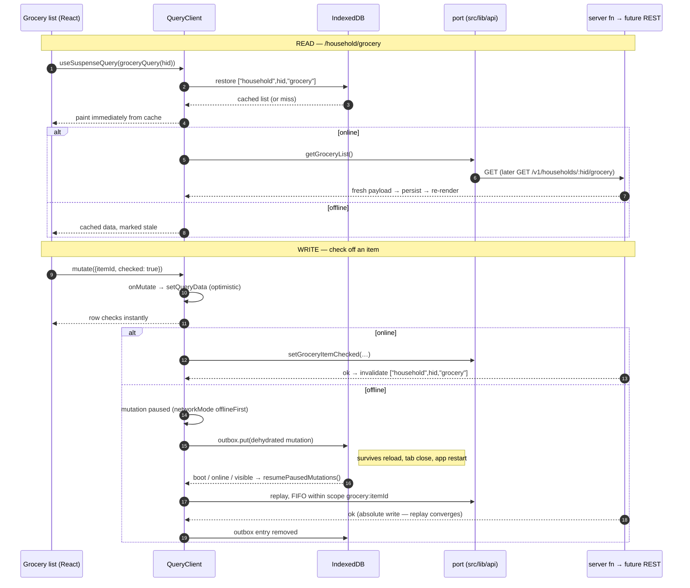

# 2026-08-11 — Offline mode (offline-capable PWA)

Status: **spec / pre-development — rev 2 (milestone re-cut)**
Depends on: `03-household-recipe-collection.md` (the box + rendered `recipe` layer),
`2026-08-06-meal-planner.md` (`meal_plan_entry`, the optimistic-patch system),
`2026-08-11-grocery-list.md` (**shipped** in #31 — `grocery_list`/`grocery_item`, the
checklist UI this plan takes offline),
`05-cook-mode.md` (the client-persistence idioms, the PWA seam in `lib/timers/alarm-delivery.ts`).

> Implementer: log outcomes to `docs/plans/results/2026-08-11-offline-mode-results.md`
> (what was built, how it was verified, deliberate deviations).

---

## 1. Overview

Buttery is a kitchen app. Kitchens have bad wifi, phones go in pockets on the way to the
grocery store, and cook mode runs for 90 minutes on a counter. The app currently cannot
survive a single dropped packet: every screen is a route `loader` calling a
`createServerFn`, every write is a direct RPC followed by `router.invalidate()`, and there
is no client cache of any kind.

**Rev 2 re-cuts rev 1 into three milestones ordered by what the household actually needs
first.** The minimum viable step is: install Buttery on a phone, walk into a store or a
dead-wifi kitchen, and be able to **read the recipe box, the meal plan, and the grocery
list — and check items off**. Rev 1 front-loaded write-path machinery (idempotency log,
result unions, conflict resolution) that reads never touch; rev 2 moves all of it behind
the point where the app is already useful offline.

| Milestone                          | Delivers                                                                                                                                           | Schema changes                                |
| ---------------------------------- | -------------------------------------------------------------------------------------------------------------------------------------------------- | --------------------------------------------- |
| **M1 — Offline reads**             | Installed PWA; recipe box, plan week, and grocery list readable offline; whole box mirrored in the background                                      | **None**                                      |
| **M2 — Idempotent offline writes** | Grocery check-offs, favorites, and meal-plan edits queue offline and replay on reconnect — made safe by _write shape_, not by an idempotency table | **None**                                      |
| **M3 — Sync hardening**            | `mutation_log`, result unions, OCC on the shared note + conflict panel, leader election, mirror progress surface, full telemetry                   | `mutation_log`, `household_recipe.updated_at` |

Each milestone ships and soaks independently. M3 has no deadline pressure: nothing in M1/M2
is throwaway, and every M3 mechanism layers on top without a rewrite (§7 is the checklist
that keeps that true).

Rev 1's other correction: it predated the grocery list. The shipped grocery surface is now
first-class here — it is the single best offline use case in the app.

### 1.1 Out of scope (all milestones)

- **The standalone API service.** Not built. §7 is the complete list of what this plan does
  differently so that building it later is a one-adapter change.
- **Offline recipe authoring, Paprika import, publishing.** `saveRecipe`,
  `commitImportChunk`, and `publishRecipe` stay online-only. They touch blob storage and
  atproto, and an unsent draft lost to Safari's evictor is worse than a disabled button.
- **Real-time sync / CRDTs / replication.** No Electric, no PowerSync, no RxDB. The server
  stays authoritative; the client holds a disposable cache (§2.1).
- **Web Push for timer alarms.** The seam is marked at `src/lib/timers/alarm-delivery.ts:6-14`;
  this plan makes it possible (installed PWA on iOS 16.4+) without taking it.
- **Background Sync API.** Not in Safari at all (§9.3). The outbox drains from the page,
  permanently.

---

## 2. Principles that constrain this design

### 2.1 The server is truth; the local copy is disposable

Every byte in IndexedDB must be reconstructible from the server. This is an iOS
requirement, not a philosophy: Safari evicts script-writable storage and refuses
`navigator.storage.persist()`, so any design where the browser holds the only copy of user
data will eventually lose that data on someone's phone. The one exception is the M2 outbox,
and its design spends its complexity budget on keeping that window short.

### 2.2 The service worker caches the app. TanStack Query caches the data. No overlap.

The service worker handles HTML, JS, CSS, and images. It **never** caches `/_serverFn/*`
or `/api/auth/*`. Data staleness has exactly one owner, with one set of rules, visible in
one devtools panel. A service worker quietly serving stale JSON that Query believes is
fresh is the worst failure mode available here; this rule makes it structurally impossible.

### 2.3 One cache owner — within the migrated surface

Today `defaultPreloadStaleTime: 0` (`src/router.tsx:10`) means the router match cache is
the only cache. M1 migrates the offline-target routes to Query (`ensureQueryData` in
loaders, `useSuspenseQuery` in components); on those routes `router.invalidate()` is dead
and `queryClient.invalidateQueries` replaces it. Routes not yet migrated keep plain
loaders — two patterns coexist deliberately, with the boundary written down (§4.1), and
the un-migrated routes are simply not offline-capable until they cross it.

### 2.4 `householdId` in a query key is a cache partition, never an authorization input

The server derives the active household from `session.active_household_id` and never
accepts it as a client argument (`src/server/recipe-context.ts:8`). That does not change.
But the _client_ must know which household a cached row belongs to, or switching
households serves one household's recipes to another — a privacy failure, not a cache bug.
So `householdId` appears in every key and in no validator. Written into the port layer,
tested.

### 2.5 Every offline-capable write is replay-safe **by shape**

A queued mutation may be delivered twice (tab reload mid-flight, retry after an ambiguous
timeout). M2's answer is not a dedupe table — it is a constraint on the write set: **only
absolute (set-state) writes go offline.** `checked: true`, `favorite: false`,
`{entryId, toDate, toSlot}`. Replaying an absolute write twice converges on the same row
state. Writes that are not absolute (quantity-merging adds, append-style creates without a
client-minted id) stay online-only until M3 gives them `mutation_log`.

### 2.6 Nothing exists only in IndexedDB except the outbox

Corollary of §2.1, stated separately because it decides what is allowed to be
offline-writable. A queued checkbox is a recoverable loss. A queued 40-minute recipe
transcription is not.

### 2.7 Household stays the minimum privacy scope

The cache is partitioned by `(did, householdId)` and wiped on sign-out, household switch,
and on any `forbidden`/membership failure from the server. A shared family iPad must not
leak one household's box into another's.

---

## 3. Why this stack

The requirement: battle-tested, IndexedDB, iOS-ready, plays well with react-query, prefer
TanStack.

| Option                                                                                                      | Verdict                                                                                                                                                                                                                                                                             |
| ----------------------------------------------------------------------------------------------------------- | ----------------------------------------------------------------------------------------------------------------------------------------------------------------------------------------------------------------------------------------------------------------------------------- |
| **TanStack Query + `experimental_createQueryPersister` (IndexedDB via `idb-keyval`) + persisted mutations** | **Chosen.** First-party, documented for exactly this, years old. `@tanstack/react-router-ssr-query` is already declared in `services/web/package.json:44` and unused — the integration was anticipated.                                                                             |
| **TanStack DB 0.6**                                                                                         | Rejected for now. Strategically interesting (live queries, real optimistic transactions) but 0.6 standardized persistence on SQLite-WASM not IndexedDB, SSR story undocumented, pre-1.0. §10 keeps the re-evaluation point; the §5 port layer is what makes a later swap contained. |
| **`@tanstack/offline-transactions`**                                                                        | Rejected as a dependency, adopted as a design source: persist-before-dispatch, FIFO per scope, leader election, backoff with jitter. M2/M3 reimplement that shape on Query's own mutation cache.                                                                                    |
| **RxDB / PowerSync / ElectricSQL**                                                                          | Rejected. Real replication protocols for a problem we do not have; all three want to own the data model.                                                                                                                                                                            |
| **Hand-rolled IndexedDB under existing loaders**                                                            | Rejected. Re-invents staleness, gc, dedupe, retry, paused mutations, devtools.                                                                                                                                                                                                      |
| **`vite-plugin-pwa` / Serwist**                                                                             | Rejected as-is. TanStack Start's Vite plugin replaces the build step they hook; community consensus in TanStack/router#4770 is a custom plugin. §4.4 takes that route, simplified by srvx serving `dist/client`.                                                                    |

New direct dependencies: `@tanstack/react-query` (promote from transitive 5.101.2),
`@tanstack/react-query-persist-client`, `@tanstack/react-query-devtools`, `idb-keyval`.
Per AGENTS.md, `pnpm add` needs `CI=true` and the sandbox disabled.

---

## 4. Milestone 1 — offline reads

Delivers: an installable Buttery that, in airplane mode, renders the recipe box (list and
every detail), the current plan week, and the grocery list. No offline writes; buttons
that would write while offline are disabled with a "you're offline" affordance.

### 4.1 Scoped TanStack Query adoption

**Routes migrating to Query in M1** (the offline surface):

- `/household/recipes` (box list) and `/household/recipes/$id` (detail + cook mode)
- `/household/plan` (week view)
- `/household/list` (the grocery list — `household.list.tsx`)
- The root-level data both depend on: session/household context, gate state (offline
  fallbacks in §4.4)

**Routes staying on plain loaders for now:** public browse/search, household admin,
invites, the import flow, settings. They migrate opportunistically later; until then they
are online-only and that is fine. The boundary rule: **a route is offline-capable iff its
data comes from a `queryOptions` factory in `src/lib/api/`.** No third state.

Router setup (`src/router.tsx`):

```ts
import { QueryClient } from "@tanstack/react-query";
import { setupRouterSsrQueryIntegration } from "@tanstack/react-router-ssr-query";

export function getRouter() {
  const queryClient = new QueryClient({
    defaultOptions: {
      queries: {
        staleTime: 30_000,
        gcTime: 1000 * 60 * 60 * 24, // survive a day so IDB restore has something to hold
        retry: (count, err) => !isSessionExpired(err) && count < 3,
      },
    },
  });

  const router = createTanStackRouter({
    routeTree,
    context: { queryClient },
    scrollRestoration: true,
    defaultPreload: "intent",
    defaultPreloadStaleTime: 0, // §2.3 — Query owns caching on migrated routes
    defaultNotFoundComponent: NotFound,
  });

  setupRouterSsrQueryIntegration({ router, queryClient });
  return router;
}
```

`__root.tsx` moves to `createRootRouteWithContext<{ queryClient: QueryClient }>()`.

Migration shape per route:

```ts
// before — src/routes/household.recipes.$id.tsx:44
loader: ({ params }) => getHouseholdRecipe({ data: { recipeId: params.id } });
const recipe = Route.useLoaderData();

// after
loader: ({ context, params }) => context.queryClient.ensureQueryData(householdRecipeQuery(hid, params.id));
const { data: recipe } = useSuspenseQuery(householdRecipeQuery(hid, params.id));
```

Components **must** call the hook rather than reading loader data — an unobserved query
gets no refetch-on-reconnect, no invalidation, and no gc protection, which is precisely
the machinery offline depends on. Add a `useActiveHouseholdId()` hook (from
`authClient.useSession()` → `session.session.active_household_id`) so no component
reaches for it twice.

**The two optimistic-update libraries are the highest-risk migrations** and both are kept:

- `src/components/plan/optimistic.ts` — tested pure patch functions + `household.plan.tsx`'s
  `run()` helper. Move from `useOptimistic` + `router.invalidate()` to Query
  `onMutate`/`onError`/`onSettled` with `setQueryData`; patch functions reused verbatim;
  `optimistic.test.ts` is the safety net, extend it.
- `src/components/grocery/optimistic.ts` — same idiom, same treatment. (Rev 1 predated it.)

M1 mutations stay **online-only**: they run through the port layer and invalidate query
keys, but `networkMode` and persistence wait for M2. While offline, write affordances
disable.

### 4.2 The query-key namespace _is_ the future URL namespace

`src/lib/api/keys.ts`. Every key is resource-shaped and carries its partition. This table
is the contract §7 depends on:

| Key                               | Today                            | Future REST                           |
| --------------------------------- | -------------------------------- | ------------------------------------- |
| `["me","households"]`             | `listMyHouseholds()`             | `GET /v1/me/households`               |
| `["household",hid,"recipes"]`     | `listHouseholdRecipes()`         | `GET /v1/households/:hid/recipes`     |
| `["household",hid,"recipes",id]`  | `getHouseholdRecipe({recipeId})` | `GET /v1/households/:hid/recipes/:id` |
| `["household",hid,"plan",week]`   | `getMealPlanWeek({week})`        | `GET /v1/households/:hid/plan?week=`  |
| `["household",hid,"grocery"]`     | `getGroceryList()`               | `GET /v1/households/:hid/grocery`     |
| `["household",hid,"members"]`     | `listHouseholdMembers()`         | `GET /v1/households/:hid/members`     |
| `["household",hid,"preferences"]` | `getHouseholdPreferences()`      | `GET /v1/households/:hid/preferences` |
| `["recipes","public","recent"]`   | `listRecentRecipes()`            | `GET /v1/recipes?sort=recent`         |
| `["recipes","public",id]`         | `getRecipe(id)`                  | `GET /v1/recipes/:id`                 |
| `["search","global",q,cursor]`    | `searchGlobalRecipes()`          | `GET /v1/recipes/search?q=`           |

Define the full namespace now even though only the `household` rows migrate in M1 —
un-migrated routes adopt their reserved keys when they cross the §4.1 boundary.
Invalidation becomes prefix-scoped and cheap: a grocery check-off invalidates
`["household",hid,"grocery"]`, not the entire router.

### 4.3 The port layer

Generalize the pattern proven in `src/lib/recipe-import/api.ts` ("swapping the transport
is one file") to the whole app:

```
src/lib/api/
  transport.ts   # the ONLY client module importing #/server/**
  types.ts       # wire DTOs, moved off the server modules
  keys.ts        # §4.2
  queries.ts     # queryOptions factories
  mutations.ts   # mutationOptions (M2 adds the setMutationDefaults registry)
  errors.ts      # SessionExpiredError (M3 adds the MutationResult union)
  index.ts       # the port surface consumers import
```

**Rule, enforced from M1 day one:** no module outside `src/lib/api/transport.ts` may
import from `#/server/**`. Add an oxlint `no-restricted-imports` rule, plus a meta-test
modeled on the existing scanner at `src/server/import-authz.test.ts:158-167` that greps
the client tree and fails on a new violation. That existing meta-test also means any new
`createServerFn` added here must be registered in its gated list or the suite fails.

### 4.4 PWA shell

**Manifest.** `services/web/public/manifest.json` exists with the correct brand colors
(`#FFD84D` / `#FFF6E3`) and is linked from nowhere — a CRA leftover. Fix and wire:
`id: "/"`, `scope: "/"`, `start_url: "/household?source=pwa"`,
`display_override: ["standalone"]`, real **maskable** 192/512 icons (current ones will
letterbox on Android), `shortcuts` for "Recipe box" and "This week", linked from
`__root.tsx` `head.links` with `apple-touch-icon`.

**Service worker build.** TanStack Start's Vite plugin replaces the build step
`vite-plugin-pwa`/Serwist hook into. Buttery is served by srvx with `--static ../client`,
so the target is simply `dist/client/sw.js` at root scope. A small local plugin,
`services/web/vite-plugins/service-worker.ts`, runs a second Rollup build of `src/sw.ts`
in `closeBundle`, injecting the emitted asset list as `__PRECACHE__`. No-op in dev —
offline behavior is verified against production builds. The SW is hand-written (~150
lines), not Workbox: the rules below are short enough that Workbox is more dependency
than value, and a hand-written SW keeps rule §2.2 auditable at a glance.

**Caching rules:**

| Request                      | Strategy                                                           |
| ---------------------------- | ------------------------------------------------------------------ |
| `/assets/*` (content-hashed) | CacheFirst, immutable, versioned cache name                        |
| `/manifest.json`, icons      | StaleWhileRevalidate                                               |
| Navigation / document        | NetworkFirst, 3s timeout → precached `/offline` shell              |
| **`/_serverFn/*`**           | **Never cached. Network-only.** (§2.2)                             |
| **`/api/auth/*`**            | **Never cached. Network-only.**                                    |
| `cdn.bsky.app` recipe images | CacheFirst into a capped LRU bucket, shared with the mirror (§4.6) |
| PostHog                      | Network-only, failures swallowed                                   |

**The offline shell.** SSR HTML embeds per-user state, so authenticated documents are
never cached. Precache one route, `/offline`, that renders the app shell with no server
data and lets the client router take over at the requested URL, hydrating from IndexedDB.
Two loaders must tolerate offline and currently do not:

- `__root.tsx:18` `loader: () => getGateState()` — offline it throws and takes the whole
  tree down. Persist the last known gate state in IDB and fall back to it; fail _open_ to
  the app (an uninvited user's cached shell is not a security boundary, the server fns are).
- `authClient.useSession()` — a network call. Persist the last-known-good session (DID,
  handle, name, `active_household_id`) and serve it offline flagged `stale: true`. It
  renders chrome; it never authorizes anything. Cleared on sign-out (§4.5).

**Update flow.** No `skipWaiting()`. A waiting worker surfaces a "New version available —
Reload" toast. Silently swapping the bundle under a running cook-mode timer is not
acceptable.

**Install.** iOS first: detect iOS Safari + non-standalone, show a custom "Add to Home
Screen" sheet with share-sheet instructions. This is a **data-durability feature**, not
cosmetics — §9.1 makes home-screen install the difference between keeping data and losing
it. Chrome/Android `beforeinstallprompt` capture is a nice-to-have; take it only if cheap.

**iOS standalone chrome.** `apple-mobile-web-app-capable`, status-bar meta,
`viewport-fit=cover` on the existing viewport meta (`__root.tsx:24-27`),
`env(safe-area-inset-*)` padding in `AppShell` (cook mode runs full-bleed and will collide
with the home indicator), overscroll suppression on the shell only. Per AGENTS.md, global
element CSS goes in `@layer base`.

### 4.5 Persistence

One IndexedDB store in M1: `buttery-queries`, one entry per query, via
`experimental_createQueryPersister` on `defaultOptions.queries.persister`. (M2 adds the
separate `buttery-outbox` store.) Per-query persistence over whole-cache
`persistQueryClient`, deliberately: restores lazily per query instead of blocking first
paint on one large blob, does not fight SSR hydration, and does not rewrite a 300-recipe
blob on every cache touch.

```ts
// src/lib/offline/persister.ts
const persister = experimental_createQueryPersister({
  storage: typeof window === "undefined" ? undefined : idbStorage, // SSR-safe, per the docs
  maxAge: 1000 * 60 * 60 * 24 * 14,
  buster: `${CACHE_SCHEMA_VERSION}:${partitionKey}`,
  prefix: "bq",
});
```

`buster` folds in the payload schema version **and** the `(did, householdId)` partition,
so a household switch or a DTO change invalidates by construction. Mirrors the
versioned-discard idiom of `COOK_STATE_VERSION` (`useCookPersistence.ts:14`) — mismatched
versions are discarded, never migrated. Storage access goes through `createClientOnlyFn`,
matching `src/lib/timers/storage.ts`, so a server-side read throws loudly.

**Wipe triggers.** `wipeCachePartition()` on: sign-out, household switch
(`switchActiveHousehold`), any membership-failure response, `CACHE_SCHEMA_VERSION` bump.
Clears the query store, the image cache bucket, and the persisted gate/session fallbacks.

**Quota.** Wrap every IDB write; on `QuotaExceededError`: stop the mirror, evict mirrored
details oldest-first, capture `idb_quota_exceeded`. Call `navigator.storage.persist()`
once on install — Chrome may grant it, Safari will not, the design depends on neither.

**Multi-tab:** queries need no coordination — last writer to a per-query IDB entry wins,
payloads are server-derived.

### 4.6 The mini-mirror

Lazy-only caching fails the actual use case: offline in a store, opening a recipe never
viewed on this phone. The box list is a single server fn returning the whole box, so the
list is offline-free after §4.5; details need prefetching. M1 ships the ~50-line version:

- After `["household",hid,"recipes"]` resolves, enqueue every `recipeId` not already
  fresh in IDB; `queryClient.prefetchQuery` each at concurrency 2.
- Batches scheduled in `requestIdleCallback` (`setTimeout` fallback for Safari).
- Pause while the document is hidden, while offline, and while a cook-mode or timer route
  is active; resume on `online`/visible. Three consecutive failures park the run until
  next app open.
- Hero thumbnails only, into the §4.4 image bucket (they are cross-origin bsky CDN URLs
  from `blobImageUrl()`, `src/lib/atproto/images.ts` — the SW rule covers them).

**Deferred to M3:** the observable progress store, the "Syncing 47 of 312" chip,
`saveData`/`effectiveType` detection, retry affordances. M1's mirror is silent and
best-effort; its only UI is that offline recipe details simply work.

### 4.7 M1 acceptance

- `pnpm test`, `tsc --noEmit`, `oxlint` green. Zero imports of `#/server/**` outside
  `src/lib/api/transport.ts`, enforced by the meta-test.
- Migrated routes: data via `queryOptions` factories only; zero `router.invalidate()`
  remaining on migrated routes. SSR still streams (view source on `/household/recipes`
  shows recipe titles — use `grep -a`; macOS grep silently skips curl'd dev-server HTML).
- Lighthouse PWA audit passes. Installs via iOS share sheet. Network killed in devtools:
  hard reload of `/household/recipes` renders the shell, not the browser offline page.
- Open the box online on a fresh profile, wait for idle mirror, airplane mode, reload:
  the list **and an unvisited recipe's detail** render from IDB. Plan week and grocery
  list render offline. Cook mode runs a full recipe with timers in airplane mode.
- Switch households: previous household's rows gone from IDB (Application panel). Sign
  out: store empty.
- A new deploy surfaces the update toast and does not swap under a running timer.
- **Device pass on a real iPhone** — installed to home screen, airplane mode, full read
  cycle. Simulator does not reproduce eviction or SW lifecycle.

---

## 5. Milestone 2 — idempotent offline writes

Delivers: the store trip. Check items off the grocery list in a dead aisle, favorite a
recipe, adjust the week's plan — all queued, all landing exactly-once-in-effect on
reconnect. Behind a **fail-closed PostHog flag** (`offline-writes`), matching the atproto
publish gate. Offline _reads_ are never gated.

### 5.1 The idempotency trick: absolute writes, no `mutation_log`

Rev 1 required a `mutation_log` table, client-minted ULIDs on every mutation, and
clock-skew clamping before any write went offline. M2 gets exactly-once-in-effect without
any of it, by constraining the write set to **absolute state**: replaying
`{checked: true}` or `{favorite: false}` or `{entryId, toDate, toSlot}` twice converges
on the same row. Double-delivery, double-drain from two tabs, retry after an ambiguous
timeout — all harmless by construction. `mutation_log` arrives in M3 only when
non-absolute writes (quantity merges, OCC'd notes) need it.

This is not a new posture for the data: the grocery list was _designed_
last-write-wins per item — "two people in the same store on two phones is the normal
case, not the edge one" (`household.list.tsx` header, grocery plan D12). M2 extends the
assumption the feature already lives by, from two online phones to one of them being
offline.

### 5.2 The M2 write set

Audited against the shipped server fns:

| Mutation                        | Shape today                                                                                    | M2 change                                                                                                                                                                                                        | Replay-safe because            |
| ------------------------------- | ---------------------------------------------------------------------------------------------- | ---------------------------------------------------------------------------------------------------------------------------------------------------------------------------------------------------------------- | ------------------------------ |
| `toggleGroceryItem`             | `{itemId, checked: boolean}` (`grocery.ts:757`) — already absolute                             | none                                                                                                                                                                                                             | set-state                      |
| `updateGroceryItem`             | absolute field patch (`grocery.ts:801`)                                                        | none                                                                                                                                                                                                             | set-state                      |
| `removeGroceryItem`             | returns `{removed: boolean}`, already-gone = `false` (`grocery.ts:849`)                        | none                                                                                                                                                                                                             | delete wins                    |
| `toggleHouseholdRecipeFavorite` | **server-side toggle** (`household-recipes.ts:461`)                                            | add `setHouseholdRecipeFavorite({recipeId, favorite})`; UI moves to it; toggle fn retired                                                                                                                        | set-state                      |
| `moveMealPlanEntry`             | `{entryId, toDate, toSlot}` (`meal-plan.ts:779`) — already intent-shaped, server owns ordering | none                                                                                                                                                                                                             | same target twice = same state |
| `removeMealPlanEntry`           | soft delete (`meal-plan.ts:851`)                                                               | none                                                                                                                                                                                                             | delete wins                    |
| `setMealPlanEntryCooked`        | absolute flag                                                                                  | none                                                                                                                                                                                                             | set-state                      |
| `addMealPlanRecipes`            | server-minted entry ids                                                                        | accept optional client-minted entry ULIDs; insert-if-absent on id. Extract `ulid()` from `src/server/household/ids.ts:45` into `src/lib/ulid.ts` (`crypto.getRandomValues`, works both sides); server re-exports | client id + insert-if-absent   |

**Stays online-only in M2** (disabled with an offline affordance):

- `addManualGroceryItem` and the recipe → list flow (`previewGroceryAdd`/`commitGroceryAdd`)
  — the live-identity merge **adds quantities**; replay would double them. Needs
  `mutation_log` (M3) or a client-minted-row redesign.
- `clearPurchasedGroceryItems`, `clearAllGroceryItems`, `deleteAllGroceryItems` — bulk
  sweeps are absolute-_looking_ but not replay-safe: the row set they touch **grows
  between queue-time and replay**, so a sweep queued Saturday and replayed Sunday clears
  rows the user never saw. Item-scoped writes carry their target id; sweeps do not.
- Recipe note edits (`upsertHouseholdRecipeNote`) and meal-plan note create — the shared
  note is where two humans erase each other; it waits for OCC + the conflict panel (M3).
- `saveRecipe`, `publishRecipe`, the import flow, household admin/invites — permanent
  (§1.1).

Replay of a write whose row vanished (`toggleGroceryItem` throws "no longer on the
list"): **drop the mutation, invalidate the key, refetch.** The refetched list is the
truth and the user sees it. No result-union plumbing needed for checkbox-weight writes.

### 5.3 The outbox core

`networkMode: "offlineFirst"` on the write set: attempt once regardless of the browser's
online guess (which lies on captive portals), pause on network failure. Queries keep
default `"online"` + the persister.

Functions do not serialize, so every offline-capable mutation is registered by key at
client boot, before hydration:

```ts
// src/lib/api/mutations.ts — defaults are static; they carry the function + callbacks
queryClient.setMutationDefaults(keys.mutation("grocery-item-checked"), {
  mutationFn: (vars: SetCheckedVars) => api.setGroceryItemChecked(vars),
  onMutate,
  onError,
  onSettled,
});

// call site — scope depends on the entity, so it is set where vars are known;
// FIFO per entity, parallel across entities. Dehydration preserves it.
useMutation({
  mutationKey: keys.mutation("grocery-item-checked"),
  scope: { id: `grocery:${itemId}` },
});
```

The mutation cache is subscribed; on change, paused mutations are dehydrated with
`dehydrate(queryClient, { shouldDehydrateMutation: m => m.state.isPaused })` and written
to a second IDB store, `buttery-outbox` (loss tolerance: **none** — this is the
durability budget; never evicted under quota pressure). On boot, after defaults are
registered, `hydrate()` restores them. `resumePausedMutations()` runs at boot, on
`online`, and on `visibilitychange` → visible; `invalidateQueries()` when the queue
drains. Draining aggressively keeps the only-copy window measured in seconds (§9.1).

**Session expiry, M2 version:** a 401 during replay stops the drain, keeps the outbox
intact, and surfaces a "sign in to sync N changes" toast; the queue drains after
re-login. That much ships in M2 — dropping queued writes because a cookie expired is
unacceptable at any milestone. What waits for M3 is only the _typed_ machinery
(`SessionExpiredError` in the retry predicate, leader-coordinated park/resume states).

**Deferred to M3, safe to skip because of §5.1:**

- _Leader election._ Two tabs double-draining absolute writes is harmless; an installed
  phone PWA is single-tab. Revisit when non-absolute writes arrive.
- _Result unions, conflict states._ Everything in M2 is LWW-by-arrival of absolute
  states; there is nothing to surface.

### 5.4 Status surface, minimal

One small chip in `AppShell`, three states: **Offline** (with pending count when > 0) /
**Syncing** / **Synced**. No sheet, no per-mutation list — that arrives with M3's
conflicts, which are the first thing worth a detail view. Run the
`buttery-design-system` and `accessibility-compliance` skills before building it; the
chip needs a polite live region announcing state changes, not per-item updates.

Telemetry (PostHog, production-only; events buffer in posthog-js's queue and flush on
reconnect): `offline_entered`/`offline_exited {durationMs}`, `outbox_enqueued {kind}`,
`outbox_replayed {kind, queuedMs}`, `outbox_dropped {kind, reason}`,
`pwa_installed`, `idb_quota_exceeded {store}`, `cache_partition_wiped {reason}`.

### 5.5 M2 acceptance

- Offline: check three grocery items, favorite a recipe, move a plan entry, then close
  the tab entirely. Reopen offline — all pending in the chip. Go online — all land,
  exactly once in effect.
- Replay the same dehydrated mutation twice against the server (manual harness) — row
  state identical after both.
- Check an item offline in tab A while tab B (online) removes it — on reconnect the
  mutation drops, the list refetches, no error surfaces beyond the row being gone.
- Kill the session server-side mid-queue — queue survives, toast prompts, drains after
  re-login.
- Flag off → no mutation persistence, writes disable offline exactly as in M1.
- **Device pass required before shipping the flag on:** real iPhone, home screen install,
  airplane mode, full read + queued write + reconnect cycle.

---

## 6. Milestone 3 — sync hardening

Everything below layers onto M1/M2 without rework. Build in this order; each item is
independently shippable.

### 6.1 `mutation_log` + result unions

The general idempotency mechanism, needed the moment a non-absolute write goes offline
(manual grocery add is the first customer). Client-minted `mutationId` ULID + `at`
wall-clock on each write; `at` clamped server-side (`at > now()` → `now()`) so a wrong
phone clock cannot permanently win LWW races.

Migration `create_mutation_log`: `household_id` (→ `household.id` cascade),
`mutation_id`, `kind`, `actor_did`, `result jsonb`, `created_at`; PK
`(household_id, mutation_id)` — scoped by household so replay dedupe cannot leak across
households (§2.7). Index `created_at`; rows older than 30 days swept by the existing cron
service. Server records the id in the same transaction as the write and returns the prior
result on a repeat.

Offline-capable mutations move to a discriminated union return (they never throw
redirects — a thrown redirect does not survive a transport boundary and means nothing to
a replay):

```ts
export type MutationResult<T> =
  | { status: "ok"; data: T; updatedAt: string }
  | { status: "duplicate"; data: T } // mutation_log hit
  | { status: "conflict"; current: T } // OCC failure
  | { status: "gone" } // deleted while offline
  | { status: "forbidden" } // no longer a member → wipe partition (§2.7)
  | { status: "invalid"; message: string };
```

`unauthenticated` is deliberately not a member — transport-level, throws
`SessionExpiredError`, handled by parking (§6.3), never per-mutation. `saveRecipe`'s
existing union (`recipes-write.ts:56-66`) is the precedent; align the names.

Per AGENTS.md: `pnpm --filter @buttery/web db:migrate:new`, `db:migrate:up`, then
**immediately** `db:codegen`; DB commands under `railway run --service buttery --` with
the sandbox disabled. Migrations require a `pnpm test:db` run — `*.db.test.ts` silently
skip without a database, so green `pnpm test` proves nothing about them.

### 6.2 The shared-note conflict

The one field where two humans genuinely erase each other's writing, so the one field
that gets UI. Migration `add_household_recipe_updated_at`
(`household_recipe.updated_at timestamptz not null default now()`, bumped manually in the
favorite/note upserts — the repo has no triggers and this does not add the first one;
`grocery_item` and `meal_plan_entry` already carry `updated_at`). Read payloads for
offline-writable entities carry `updatedAt`.

`upsertHouseholdRecipeNote` takes `baseUpdatedAt`; mismatch → server writes nothing,
returns `{status: "conflict", current}`. Client keeps the local body in the outbox,
marks the mutation conflicted, detail pane shows a two-pane panel:

> **Your offline note conflicts with a change made here.**
> [ your version ] [ their version ] — _Keep mine_ / _Keep theirs_ / _Edit together_

"Edit together" pre-fills the editor with both bodies separated by a rule — a crude
merge and an honest one. Nothing resolves silently; nothing is discarded until the user
picks. The chip gains its fourth state, **Needs attention**, and the tap-through sheet
listing pending writes and conflicts.

Deliberately not built, ever, on this data: field-level/three-way merges, vector clocks,
cross-entity transactions. Wrong amount of machinery for a two-to-five-person household;
all addable later on top of `updated_at` + `mutation_log` without a data migration.

### 6.3 Outbox hardening

- **Leader election**: `BroadcastChannel("buttery-outbox")`, heartbeat + takeover on
  silence; exactly one tab drains, followers observe via IDB. Required once non-absolute
  writes exist.
- **Session parking**: transport throws typed `SessionExpiredError`; retry predicate
  refuses it; leader stops draining; UI prompts re-auth; resume on sign-in. Dropping a
  queued note because a cookie expired is unacceptable.
- Exponential backoff with jitter on replay failure.
- Offline manual grocery add rides on `mutation_log`.

### 6.4 Mirror progress surface

Upgrade the M1 mini-mirror with the observable store (`state: idle | running | paused |
parked | complete`, `total`, `synced`, `failed`, `pausedReason`), persisted to IDB meta,
exposed via `useMirrorProgress()`, rendered in the chip as "Syncing 47 of 312 recipes"
with a thin progress bar → checkmark on complete, retry on parked. Add
`navigator.connection.saveData` / `effectiveType` (`2g`/`slow-2g`) pausing. Progress
control needs `role="progressbar"` + `aria-valuenow`/`aria-valuemax` and a polite live
region announcing completion only. Acceptance: on Slow 3G it still yields — main-thread
long tasks under 50ms.

### 6.5 Full telemetry

Add to §5.4's set: `outbox_conflict {kind}`, `outbox_parked {pending}`,
`mirror_started/progress/completed/parked`, `pwa_install_prompted {platform}`,
`sw_update_available`/`sw_update_applied`.

### 6.6 M3 acceptance

- Force duplicate delivery of a `mutationId` — server returns `duplicate`, no double
  write (proven in `pnpm test:db`).
- Two browsers, one household: A edits a note offline, B edits it online, A reconnects →
  panel shows both, neither lost, either choice persists.
- A and B move the same plan entry offline/online → positions converge, no duplicates,
  no crash.
- Expire the session mid-queue → parks, drains after re-login, nothing dropped.
- Manual grocery add offline, replayed twice → one row, quantities not doubled.

---

## 7. The API-service seam — what changes when, and why

Extracting a dedicated API service later fails for boring reasons: scattered call sites,
server-module-only types, thrown class instances, no idempotency. This plan fixes all
four as a side effect, because offline needs the same things. Nothing here builds the
service.

| Concern           | Today                                                                      | After which milestone                                                       | Cost at extraction                                                                                  |
| ----------------- | -------------------------------------------------------------------------- | --------------------------------------------------------------------------- | --------------------------------------------------------------------------------------------------- |
| **Transport**     | Components import `#/server/x`                                             | M1: one adapter in `src/lib/api/transport.ts`                               | Rewrite one file to `fetch()`                                                                       |
| **Auth**          | better-auth cookie, same-origin                                            | M1: the port owns _how a call is authenticated_                             | Bearer or parent-domain cookie in the adapter; CORS + `trustedOrigins`                              |
| **`householdId`** | Server-only, from session                                                  | M1: also a client cache partition in every key (§2.4)                       | Becomes a path segment; server still verifies via `assertMember`                                    |
| **Wire types**    | `interface`s exported from server modules                                  | M1: moved to `src/lib/api/types.ts`; server imports _from there_            | Promote to `@buttery/api-types`                                                                     |
| **Validation**    | `.validator()` closures inline                                             | M1–M2: Zod request schemas in a shared module, used by validator _and_ port | Same schemas become API request contracts                                                           |
| **Errors**        | Thrown classes, `throw redirect()`                                         | M3: offline writes return unions; reads keep throwing                       | Union variants map 1:1 to status codes                                                              |
| **Idempotency**   | None                                                                       | M3: `mutationId` + `mutation_log`                                           | Becomes the `Idempotency-Key` header, zero server change                                            |
| **Domain logic**  | Mostly separated already (`grocery.ts`, `meal-plan.ts` thin-wrapper idiom) | Unchanged — keep the idiom                                                  | API service imports the same domain modules                                                         |
| **Blob upload**   | base64 in `SaveRecipeInput`, ≤1MB                                          | Unchanged, online-only                                                      | Flagged, not solved: multipart or presigned PUT                                                     |
| **SSR**           | Server fn runs in-process                                                  | Unchanged                                                                   | Web server becomes an API client; internal base URL + s2s auth. Called out so it is not a surprise. |

**One-sentence version:** after M1 the client is one-file swappable; after M3 the wire
contract (unions, idempotency key, schemas) is REST-shaped too.

---

## 8. The recipe entity, end to end (M2 shape)



M3 extends the replay arm with `duplicate | conflict | gone | forbidden` handling and the
parked/conflicted lifecycle states.

---

## 9. iOS readiness (constrains every milestone)

### 9.1 Seven-day eviction — the reason install matters

Safari erases IndexedDB, localStorage, Cache Storage, and SW registrations for sites not
interacted with for seven days. **Home-screen web apps are outside Safari and keep their
own usage counter** — an installed Buttery is exempt. Consequences, all load-bearing
above: the install sheet (§4.4) is a data-durability feature; the server stays truth
(§2.1) so eviction is a cold start, not data loss; the outbox drains aggressively (§5.3)
so the only-copy window is seconds; authored content never queues (§2.6).

### 9.2 `navigator.storage.persist()`

Safari does not grant it. Call once anyway (Chrome may); design as though it always
returns false. Quota ≈1GB on iOS but varies; the image cache is capped well under it and
degrades first (§4.5).

### 9.3 No Background Sync API — permanent constraint

Safari implements neither Background Sync nor Periodic Background Sync. The outbox
**drains from the page, never from the SW.** The SW is a static-asset cache and nothing
more; no flow may assume work happens while the app is closed. The single most important
iOS finding in this plan.

### 9.4 Web Push

iOS 16.4+, home-screen-installed PWAs only. Out of scope; this plan delivers the
precondition, and the PWA-seam comment at `src/lib/timers/alarm-delivery.ts:6-14` names
the insertion point (`ServiceWorkerPushDelivery`, behind the same `AlarmDelivery` interface).

### 9.5 SW lifecycle

iOS kills SWs aggressively and restarts them cold. The SW must hold no in-memory state
between events. (It holds none — §9.3.)

---

## 10. Deferred

- **Re-evaluate TanStack DB** at 1.0 with a documented SSR story. The §4.3 port layer and
  §4.2 key namespace make the swap contained — collections would replace `queries.ts` and
  `mutations.ts`, nothing else.
- **Web Push for timer alarms** — §9.4.
- **Offline recipe authoring**, once §9.1's durability story is proven in production and
  blob staging has an answer.
- **Field-level / three-way note merge**, on top of `updated_at` + `mutation_log`.
- **Offline add-to-grocery from a cached recipe** — wants the M3 `mutation_log` plus a
  client-side preview against the (already client-safe) lexicon; design when M3 lands.
- **Extraction of the API service** — §7 is its checklist.

---

## Sources

- [TanStack Query — persistQueryClient](https://tanstack.com/query/latest/docs/framework/react/plugins/persistQueryClient) · [createPersister (per-query)](https://tanstack.com/query/latest/docs/framework/react/plugins/createPersister) · [Mutations / paused + `resumePausedMutations`](https://tanstack.com/query/latest/docs/framework/react/guides/mutations) · [Network mode](https://tanstack.com/query/latest/docs/framework/react/guides/network-mode)
- [TanStack Router — Query integration](https://tanstack.com/router/latest/docs/integrations/query) · [tkdodo — TanStack Router and Query](https://tkdodo.eu/blog/tan-stack-router-and-query)
- [TanStack DB 0.6 — persistence & offline](https://tanstack.com/blog/tanstack-db-0.6-app-ready-with-persistence-and-includes) · [TanStack DB overview](https://tanstack.com/db/latest/docs/overview) · [`@tanstack/offline-transactions`](https://www.npmjs.com/package/@tanstack/offline-transactions)
- [TanStack Start — Server Functions](https://tanstack.com/start/latest/docs/framework/react/guide/server-functions) · [Server functions and when you still need REST](https://jilles.me/tanstack-start-server-functions-how-they-work/)
- [TanStack Start + PWA (TanStack/router #4770)](https://github.com/TanStack/router/discussions/4770) · [PWA offline support with TanStack Start](https://robelest.com/journal/pwa-tanstack-start)
- [Building an offline PWA with TanStack DB + RxDB](https://rxdb.info/articles/tanstack-db/tanstack-db-pwa.html)
- [Safari iOS PWA data persistence beyond 7 days](https://developer.apple.com/forums/thread/710157) · [PWA iOS limitations & Safari support 2026](https://www.magicbell.com/blog/pwa-ios-limitations-safari-support-complete-guide)
